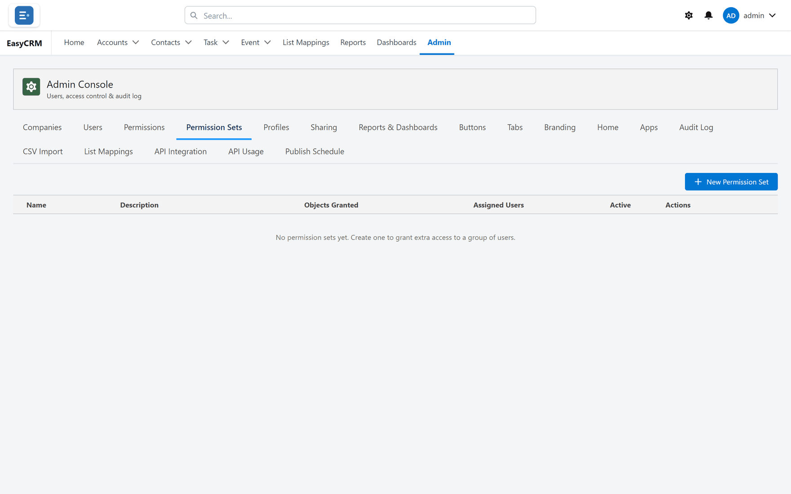
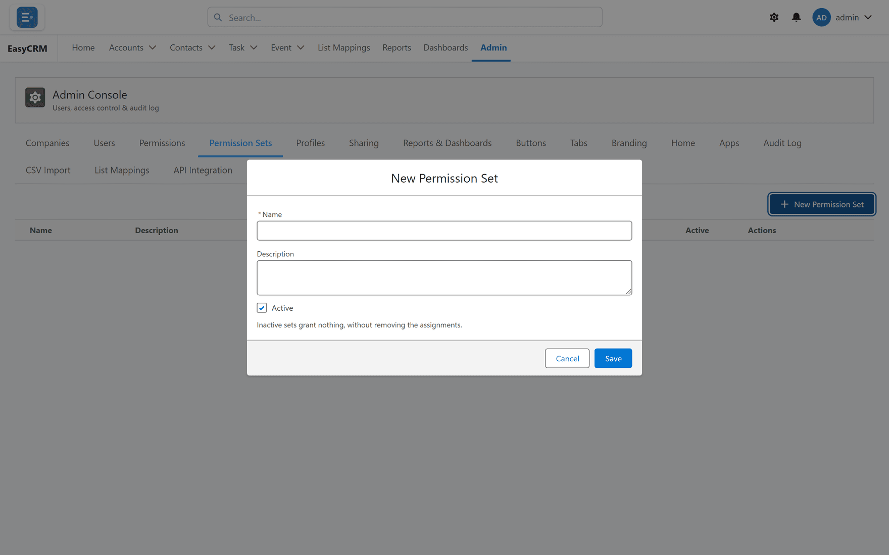

# Permission Sets

**What it is.** A named bundle of extra access that you hand to particular people.

**What it does.** It adds to whatever those people already have from their role and
[profile](./profiles.md).

**Why it helps.** When three people need more than everybody else doing their job, you give
those three a permission set instead of widening the access of the whole group.

## Opening it

**Where:** **Admin** → **Permission Sets**

1. Click **Admin** in the top menu.
2. Click **Permission Sets** in the row of tabs.

## Creating one

**Where:** **Admin** → **Permission Sets** → **New Permission Set**

1. Click **Admin**, then **Permission Sets**.
2. Click **New Permission Set**.
3. Name it after what it grants, such as "Can delete contacts".

   

4. Tick what it allows.
5. Click **Save**.

## Giving it to somebody

**Where:** **Admin** → **Users** → the person's row → **Manage permission sets**

1. Click **Admin**, then **Users**.
2. Find the person in the list.
3. Click **Manage permission sets** in their row.
4. Tick the sets they should have.
5. Click **Save**.

One person can have several. They all add together.

## It can only ever add

A permission set never takes access away. If somebody already has something, no permission set
will remove it.

To take access away you either change their [profile](./profiles.md), change their
[permissions](./permissions.md) directly, or use a
[restriction rule](../sharing/restriction-rules.md) for which records they see.

## Taking one back

Open **Manage permission sets** for that person and untick it. They lose whatever only that
set was granting, and keep everything their profile gives them.

## Naming them

Name a permission set after **what it grants**, because that is what you are looking for when
assigning it. "Can delete contacts" is useful. "Extra access 2" is not.
