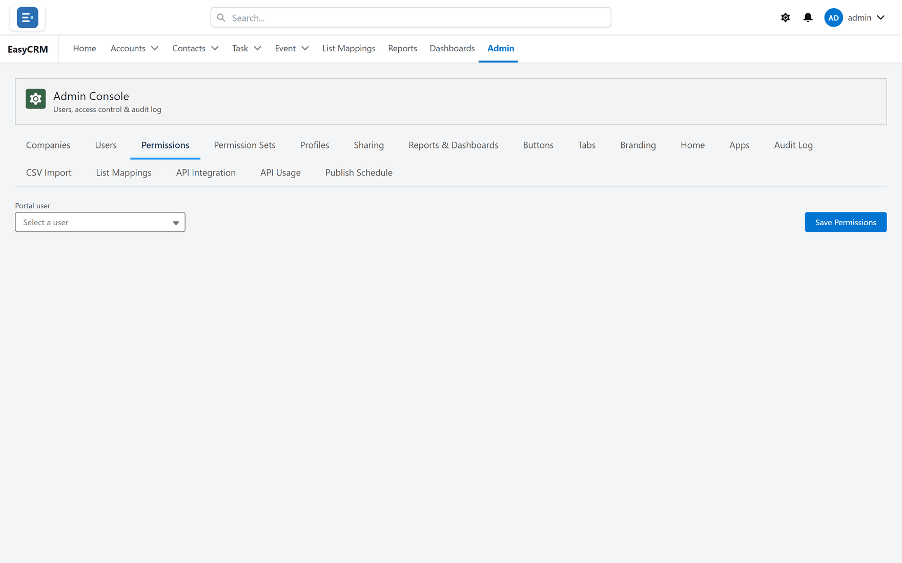
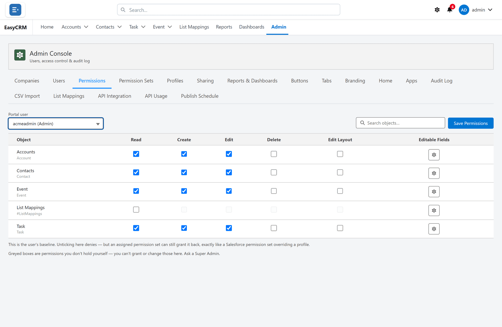

# Permissions

**What it is.** What one person may **do** with each kind of record.

**What it does.** For every kind of record you allow reading, creating, editing, deleting,
changing the page layout, and which fields they may edit.

**Why it matters.** This is only half of access. [Sharing](../sharing/index.md) decides **which**
records somebody sees. Permissions decide what they may do to the ones they can see. Read
permission with no sharing shows an empty list.

## Opening it

**Where:** **Admin** → **Permissions** → **Select a user**

1. Click **Admin** in the top menu.
2. Click **Permissions** in the row of tabs.
3. The page shows one box, **Portal user**, and nothing else.

**This is set one person at a time**, not per role, so the page stays blank until you choose
somebody.

4. Click **Select a user** and pick a person.
5. The table of objects appears.

## The six things you can allow

Each row is a kind of record. Each column is something that person may do with it.

| Column | Lets them |
|---|---|
| **Read** | See the records. |
| **Create** | Add new ones. |
| **Edit** | Change existing ones. |
| **Delete** | Remove them permanently. |
| **Edit Layout** | Change the [page layout](../layouts/index.md) for everybody. |
| **Editable Fields** | A gear opening field-by-field control over what they may change. |

Tick what the person should have, then click **Save Permissions** at the top right.

If there are many objects, use **Search objects...** to find one.

## Edit Layout is more powerful than it looks

**Edit Layout** does not change that person's own view. It lets them change the record page
**for everybody** who sees that kind of record.

Give it only to people who should be deciding what the whole company's record pages look like.

## Editable Fields

**Edit** is all-or-nothing for the record. **Editable Fields** narrows it to particular fields.

1. Click the gear in the **Editable Fields** column.
2. Choose which fields that person may change.

Use it when somebody should maintain a few fields without being able to alter the rest.

## Two rules printed on the screen

**Unticking denies — but a permission set can grant it back.** What you set here is the
person's *baseline*. If they also have a [permission set](./permission-sets.md) granting
something, the permission set wins. If you untick something and it still works, look for a
permission set.

**Greyed boxes are permissions you do not hold yourself.** You cannot grant access you do not
have. If a box is grey rather than empty, ask a Super Admin to set it.

## Sensible starting points

| Kind of person | Usually needs |
|---|---|
| Somebody who looks things up | Read |
| Somebody doing the day job | Read, Create, Edit |
| A team lead | Read, Create, Edit, sometimes Delete |
| Whoever designs the record pages | Also Edit Layout |

**Be careful with Delete.** It is permanent, and most people never need it. Leave it off
unless somebody has asked and can say why.

## If several people need the same thing

One person at a time is slow. For a group who all need the same access, use a
[profile](./profiles.md) for the baseline and a [permission set](./permission-sets.md) for
anything extra.

## When somebody still cannot see records

Permissions are only half. If the tick boxes look right and their list is still empty, the
problem is [sharing](../sharing/index.md). Use
[Checking who can see a record](../sharing/record-access.md) to find out which of the two it is.
