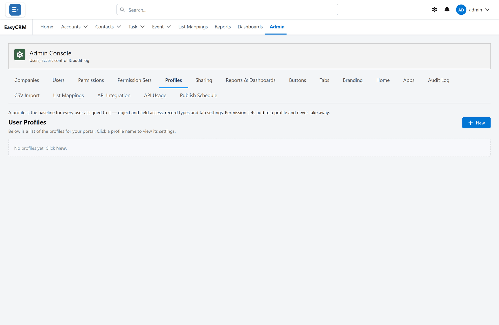
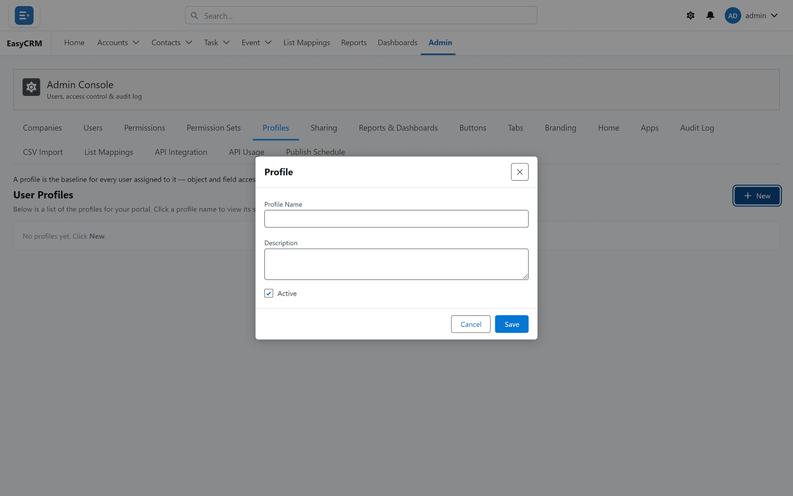

# Profiles

**What it is.** The starting access for a kind of person.

**What it does.** Everybody on the same profile gets the same baseline.

**How it differs from a permission set.** A profile is what that kind of person **always**
needs. A [permission set](./permission-sets.md) is the exception you add on top for a few
people.

## Opening it

**Where:** **Admin** → **Profiles**

1. Click **Admin** in the top menu.
2. Click **Profiles** in the row of tabs.

## Creating one

**Where:** **Admin** → **Profiles** → **New**

1. Click **Admin**, then **Profiles**.
2. Click **New**.
3. Give it a name describing the kind of person, such as "Sales rep".

   

4. Set what it allows.
5. Click **Save**.

## Giving it to somebody

**Where:** **Admin** → **Users** → the person's row → **Set profile**

1. Click **Admin**, then **Users**.
2. Find the person.
3. Click **Set profile** in their row, and choose the profile.

## Naming profiles

Name a profile after the **job**, not the access. "Sales rep" still makes sense in a year.
"Can edit accounts" stops making sense the first time you change what it grants.

## Profile, permission set, or neither?

| Situation | Use |
|---|---|
| Everybody doing this job needs it | A **profile**. |
| A few people need extra | A [permission set](./permission-sets.md). |
| One person, one object, one time | [Permissions](./permissions.md) directly. |

Reach for a profile first. Setting permissions person by person works, but it does not scale
and nobody can tell later why somebody has what they have.
