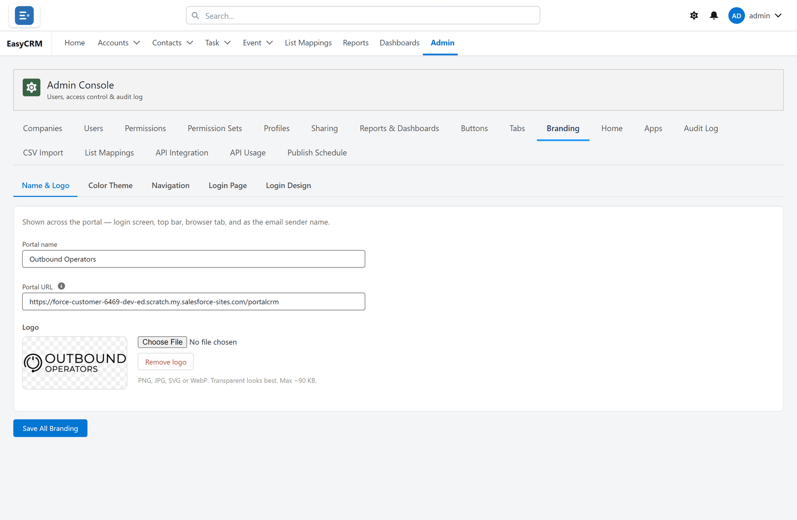
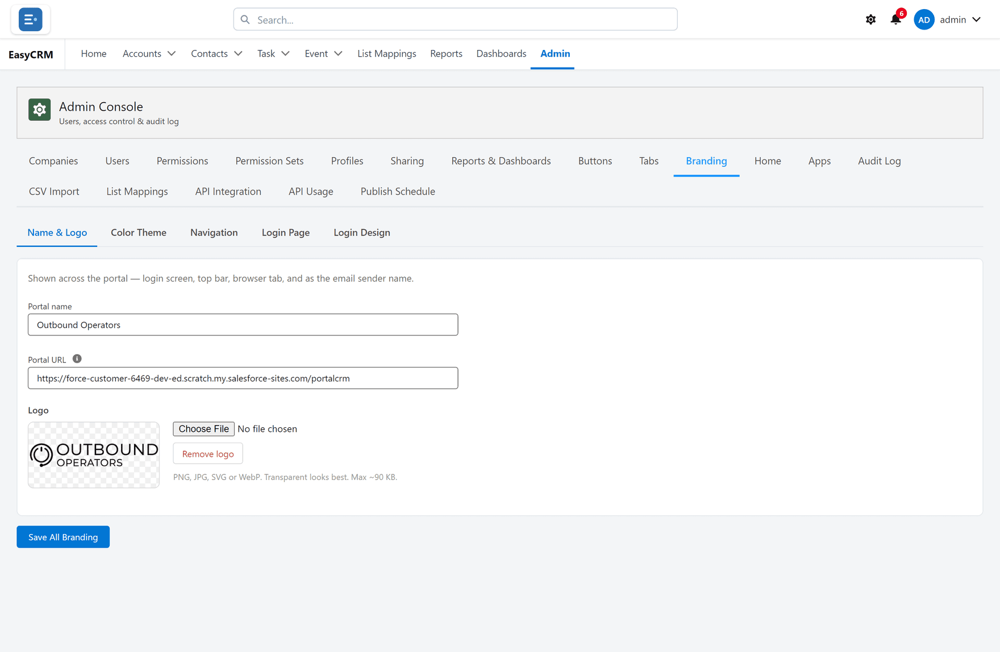
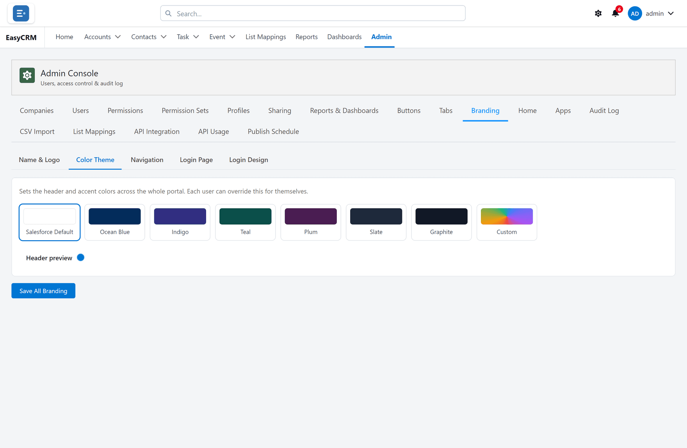
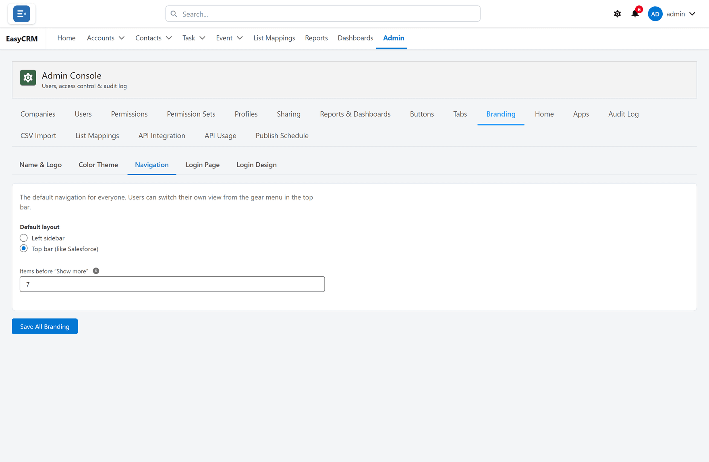
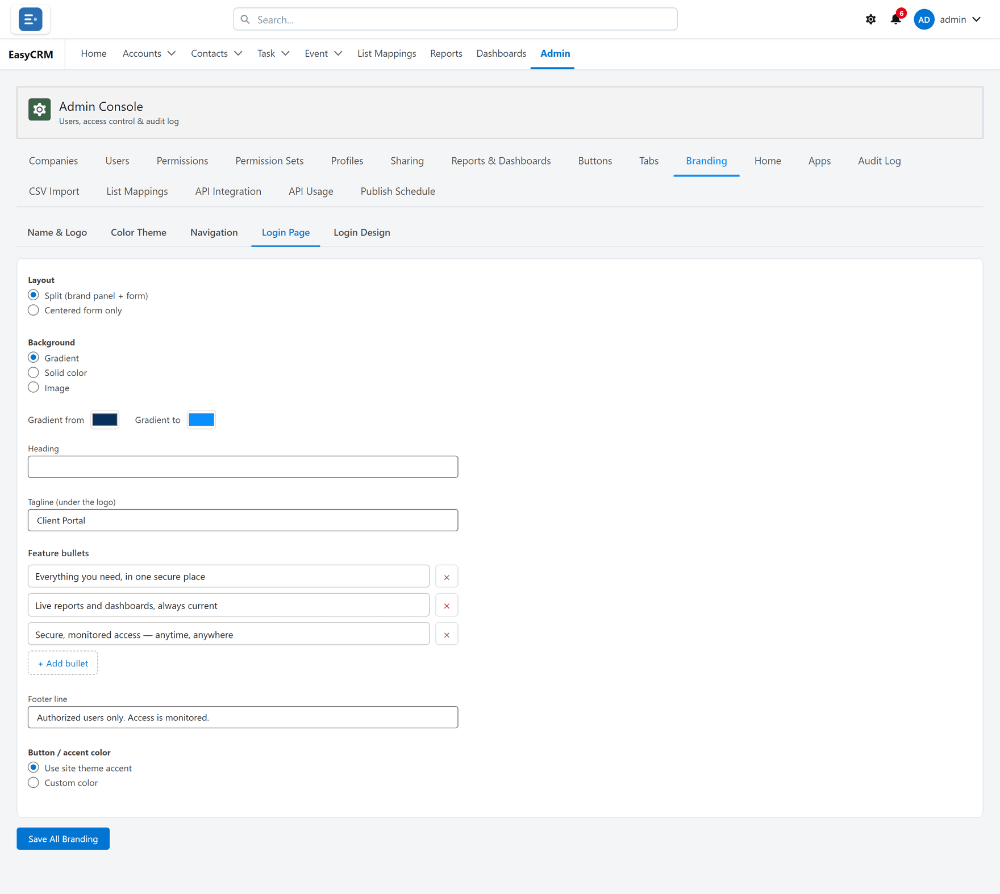

# Branding

**What it is.** The portal's name, logo, colours and sign-in page.

**What it does.** It makes the portal look like your company instead of a product nobody has
heard of.

**Why it helps.** People trust something that looks like it belongs to their own company,
especially on the sign-in page, which is the first thing they ever see.

## Opening it

**Where:** **Admin** → **Branding**

1. Click **Admin** in the top menu.
2. Click **Branding** in the row of tabs.

The screen is in five panels. Everything is saved together with **Save All Branding** at the
bottom.

## Name and logo

**Where:** **Admin** → **Branding** → **Name & Logo**

1. Type your company's name in the name box. This appears beside the logo and on the browser
   tab.
2. Upload a logo. A wide image with a transparent background works best, because it sits on a
   coloured bar.
3. **Remove logo** takes it away again and falls back to the name on its own.
4. Set the **Portal URL** if the box is empty — it is the address people use.

## Colours

**Where:** **Admin** → **Branding** → **Color Theme**

Pick a preset, or set your own colours. The preview updates as you choose.

Check the result with real text in front of you: a dark bar with dark text is unreadable, and
the preview is where to notice that.

## Navigation

**Where:** **Admin** → **Branding** → **Navigation**

Sets whether people get the menu **across the top** or **down the left** by default.

It is only a default. Anybody can change it for themselves with the gear in the top bar.

## The sign-in page

**Where:** **Admin** → **Branding** → **Login Page**

The simple settings: heading, tagline, the bullet points, and the footer line.

## The sign-in designer

**Where:** **Admin** → **Branding** → **Login Design**

For full control over the sign-in page, including building it out of blocks. See
[The sign-in page](./login-design.md).

## Saving

Click **Save All Branding** at the bottom. One button saves every panel.

People see the change the next time they load a page. They do not need to sign out.
