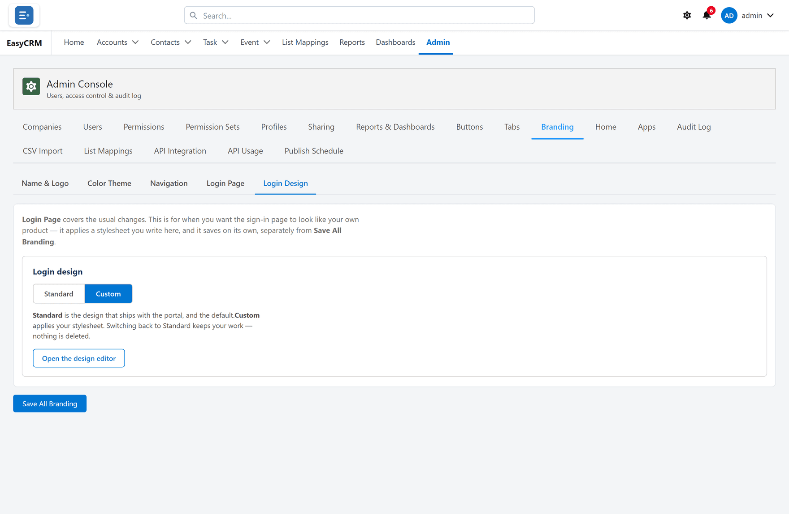

# The sign-in page

**What it is.** An editor for the page people see before they sign in.

**What it does.** You build the page out of blocks — headings, text, images, logos, links —
and arrange them across the two halves of the screen.

**Why it helps.** The sign-in page is the first thing anybody sees, and the only page people
who are not signed in ever see. This lets you make it look like your company without anybody
writing code.

## Opening the designer

**Where:** **Admin** → **Branding** → **Login Design**

1. Click **Admin** in the top menu.
2. Click **Branding** in the row of tabs.
3. Click **Login Design**.

For simple changes — heading, tagline, bullet points, footer — use **Login Page** instead,
which is the panel above it. See [Branding](./branding.md).

## Draft, preview, publish

Nothing you do takes effect for anybody until you publish. There are three states, and keeping
them straight is the whole point.

| Action | What happens |
|---|---|
| **Save draft** | Kept for you. Nobody else sees it. |
| **Live preview** | Shows the result as you work. |
| **Publish** | Everybody sees it from now on. |

Work in a draft, check the preview on both desktop and phone, then publish.

**Restore** puts back an earlier version. Use it the moment a published change turns out to be
wrong — it is faster than undoing by hand.

## Building with blocks

Click anything in the preview to edit it. Each block has its own settings: alignment, width,
height, tone, and whether it is clickable.

| Block | What it is for |
|---|---|
| **Heading** | The big line. |
| **Text** | A sentence or two. |
| **Eyebrow** | A small label above a heading, with an optional dot. |
| **Logo** | Your uploaded logo, or an image you add. |
| **Link** | A clickable line, such as your website. |
| **Separator** | A dividing line. |
| **Spacer** | Breathing room between blocks. |

Blocks sit in regions: the **brand** panel on the left, and above or below the sign-in form on
the right.

## Desktop and phone

Switch between **Desktop** and **Phone** in the preview.

A layout that looks balanced on a wide screen can be cramped on a phone, and plenty of people
sign in on one. Check both before publishing.

## Standard or custom

| Mode | What people get |
|---|---|
| **Standard** | The built-in design with your name, logo and colours. |
| **Custom** | The blocks you have built. |

Switching to **Standard** does not delete your custom design. You can switch back and it is
still there.

## If you want help with the design

The editor can produce a prompt to paste into an AI tool, and accept the answer back as a
design. **Copy AI prompt**, paste the reply into **Paste AI answer**, and check the preview
before publishing.

Treat whatever comes back as a draft, not a finished page.

## The sign-in boxes cannot be moved

The username box, the password box and the **Log In** button are fixed. Nothing you add here
can move them, hide them, or imitate them.

That is deliberate. It means no design change — by anybody, deliberate or not — can turn the
sign-in page into something that collects passwords and sends them elsewhere.
