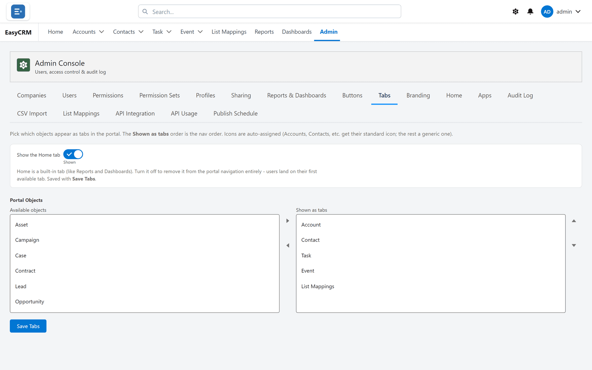

# Tabs

**What it is.** Which tabs appear across the top of the portal, and in what order.

**What it does.** You move objects between "available" and "shown", and arrange the shown ones.

**What it is not.** Hiding a tab hides the way in, not the data. Somebody can still reach those
records through search or a report. Use [Permissions](../access/permissions.md) and
[Sharing](../sharing/index.md) to control access.

## Opening it

**Where:** **Admin** → **Tabs**

1. Click **Admin** in the top menu.
2. Click **Tabs** in the row of tabs.

You see two lists side by side:

- **Available objects** on the left — things not currently shown as tabs.
- **Shown as tabs** on the right — the tabs people see, top to bottom matching left to right
  across the screen.

## Adding a tab

1. Click an object in the **Available objects** list on the left.
2. Click **Move selection to Shown as tabs**.
3. Click **Save Tabs**.

## Removing a tab

1. Click the tab in the **Shown as tabs** list on the right.
2. Click **Move selection to Available objects**.
3. Click **Save Tabs**.

Nothing is deleted. The records are still there, and anybody with permission can still reach
them by searching.

## Changing the order

1. Click a tab in the **Shown as tabs** list.
2. Click **Move selection up** or **Move selection down**.
3. Repeat until the order is right.
4. Click **Save Tabs**.

The order here is the order across the top of the screen, left to right. Put the ones people
use every day first.

## Nothing takes effect until you save

Click **Save Tabs**. People see the change the next time they load a page.

## Tabs and apps

If you use [apps](./apps.md), each app has its own set of tabs. This screen sets the overall
list; the app decides which of them that app shows.
