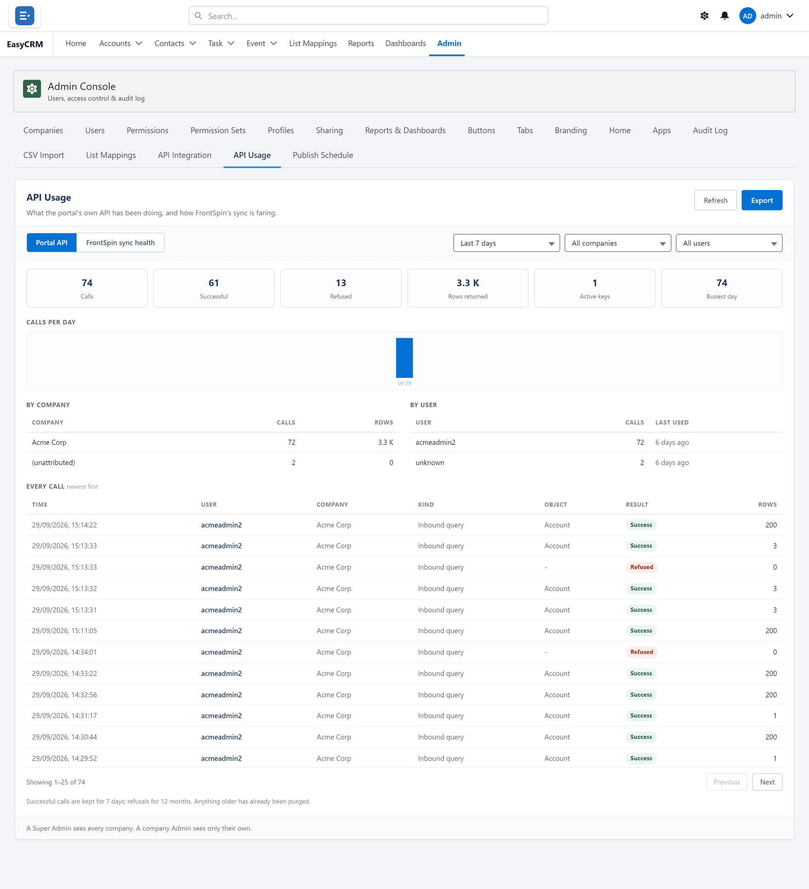

# API Usage

**What it is.** How much each API key is being used, and what it asked for.

**What it does.** It counts requests over a period, broken down by company and by user.

**Why it helps.** It answers three questions quickly: is the key working, which system is
busiest, and is anything being used far more than expected.

## Opening it

**Where:** **Admin** → **API Usage**

1. Click **Admin** in the top menu.
2. Click **API Usage** in the row of tabs.

## Choosing what to look at

Across the top:

| Control | What it does |
|---|---|
| **Last 7 days** | The period. Change it to look further back. |
| **All companies** | Narrow to one company. |
| **All users** | Narrow to one person's key. |
| **Previous** / **Next** | Move through the periods. |
| **Refresh** | Fetch the latest figures. |

The two halves — **Portal API** and **FrontSpin sync health** — are separate: one is your own
API keys, the other is a specific integration's health.

## Taking the figures away

Click **Export** to download them as a spreadsheet, for a report or a conversation about
costs.

## Reading it

| What you see | What it usually means |
|---|---|
| Zero requests from a key you expect to be busy | The other system is not calling, or is failing before it reaches you. |
| A sudden rise | A change at the other end — often a loop. |
| Steady, predictable volume | Working normally. |

A key with no traffic at all for a long time is usually one nobody needs any more. Consider
revoking it under [API Integration](./api-integration.md).
