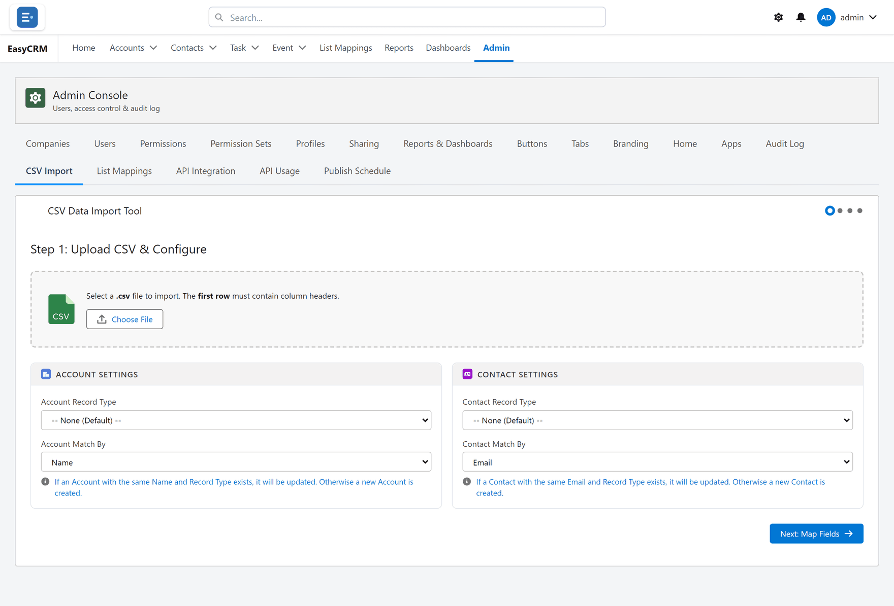

# CSV Import

**What it is.** Loading many records at once from a spreadsheet.

**When to use it.** Moving in from another system, or adding a bought list. For one or two
records, just use **New** on the list instead.

**Why it helps.** Hundreds of records in one go, instead of one form at a time.

## Opening it

**Where:** **Admin** → **CSV Import**

1. Click **Admin** in the top menu.
2. Click **CSV Import** in the row of tabs.

## Preparing your spreadsheet

Before you start:

1. Put the **field names in the first row**. One row per record after that.
2. Remove blank rows and any summary rows at the bottom.
3. Save it as **CSV** — in Excel, **File → Save As → CSV (Comma delimited)**.

Dates should be in a consistent format throughout. Mixed formats are the most common cause of
a failed import.

## Importing

**Where:** **Admin** → **CSV Import** → choose a file → match columns → **Import**

1. Click **Admin**, then **CSV Import**.
2. Click **Choose file** and pick your CSV.
3. The screen shows your columns alongside the portal's fields.
4. For each column, choose which field it belongs in. Columns whose names match are matched
   for you.
5. Leave anything you do not want to import unmatched.
6. Click **Import**.

A summary tells you how many records were created, and lists anything that failed with the
reason.

## Try ten before you try ten thousand

Copy your spreadsheet, delete all but ten rows, and import that first.

If the ten land correctly, import the rest. If something is wrong, you have ten records to
tidy up instead of ten thousand.

## If rows fail

The summary names the row and the reason. The usual causes:

| Reason | Fix |
|---|---|
| A required field is empty | Fill it in the spreadsheet. |
| A date is not a valid date | Use one consistent format. |
| A value is not an allowed option | Match it to one of the options exactly. |

Fix those rows in a fresh CSV and import just those.

## Records already in the portal

Import **adds** records. It does not look for matches and update them. Importing the same file
twice gives you two copies of everything.
