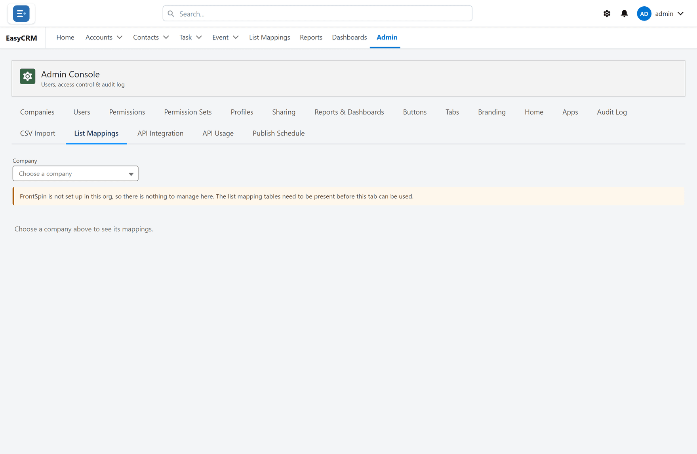
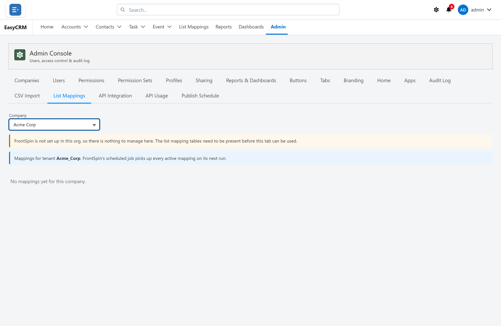

# List Mappings

**What it is.** How an incoming spreadsheet's columns line up with your fields.

**What it does.** You say once that their "Company Name" is your "Account Name", and every
later list from that source lands correctly.

**Why it helps.** Without it, somebody re-matches the same columns by hand every time a list
arrives.

## Opening it

**Where:** **Admin** → **List Mappings** → **Choose a company**

1. Click **Admin** in the top menu.
2. Click **List Mappings** in the row of tabs.
3. The page asks you to **Choose a company** first — mappings belong to a company, because
   different sources send different formats.

4. Choose the company.
5. Its mappings appear.

## Creating a mapping

1. Choose the company.
2. Click **New**.
3. Name the mapping after where the list comes from.
4. For each incoming column, choose which of your fields it belongs in.
5. Leave anything you do not want unmapped.
6. Click **Save**.

## Getting the column names right

The incoming column names must match **exactly** — including capital letters and spaces. "Company
Name" and "company name" are not the same thing to the mapping.

The safest way is to copy the heading straight out of a real file from that source.

## Changing one

Open it, change the matching, and save. It applies to lists arriving from then on. Records
already loaded are not touched.

## How it relates to CSV Import

[CSV Import](./csv-import.md) is you loading a file by hand, matching columns as you go. A
list mapping is for lists that arrive repeatedly from the same place, so nobody has to match
them each time.

Same idea; one is a one-off, the other is standing.
