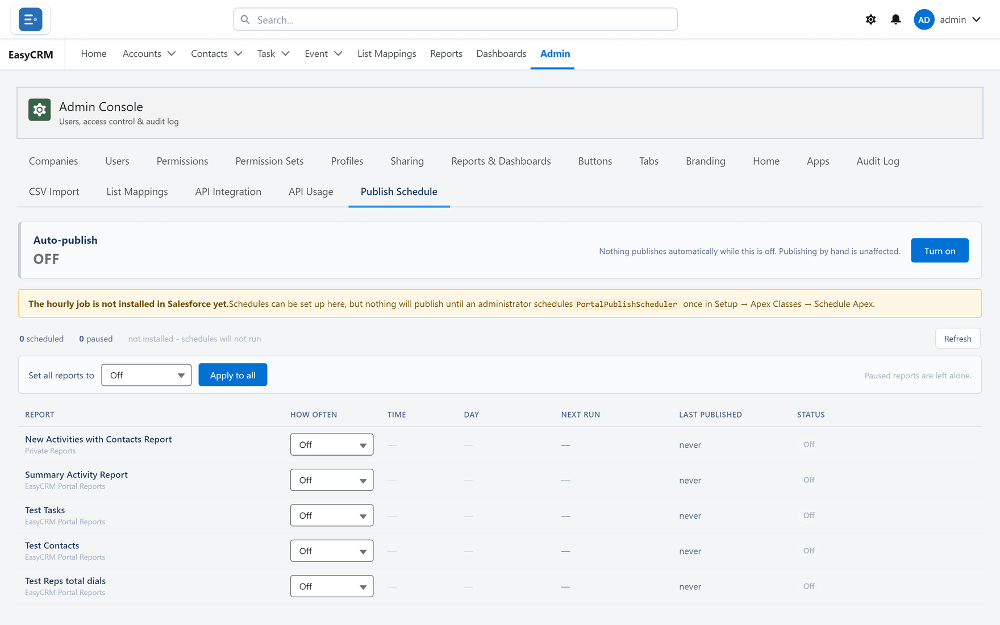

# Publish Schedule

**What it is.** Copying portal reports into Salesforce automatically, on a timetable.

**What it does.** It re-creates a portal report as a Salesforce report, and keeps it updated.

**Why it helps.** People who work in Salesforce see the same numbers as people in the portal,
without anybody rebuilding the report twice or exporting it by hand.

## Opening it

**Where:** **Admin** → **Publish Schedule**

1. Click **Admin** in the top menu.
2. Click **Publish Schedule** in the row of tabs.

## It starts switched off

Automatic publishing is **off** until somebody turns it on. That is deliberate: it writes into
Salesforce on a timer, and that should be a decision rather than a default.

1. Click **Turn on** at the top.
2. Set the schedule for each report.

## Scheduling a report

1. Find the report in the list.
2. Choose how often it should publish.
3. Click **Save**.

**Apply to all** sets the same frequency for every report at once, which is quicker when you
want them all on the same rhythm.

## Choosing a frequency

Match it to how fast the data changes and who is waiting for it.

| Frequency | Suits |
|---|---|
| Hourly | Numbers people watch during the day. |
| Daily | Most reports. |
| Weekly | Summaries nobody reads more often than that. |

More often is not better. Each publish does real work, and a report nobody looks at before
Monday does not need rebuilding every hour.

## Checking it worked

Click **Refresh**. Each report shows when it last published and whether it succeeded.

## If a report is deleted

Its schedule **pauses**. It does not quietly create a new report in Salesforce to replace the
one somebody deleted.

That is on purpose: deleting a report is usually deliberate, and silently re-creating it would
undo the decision. Set up a new schedule if you want it back.

## Turning it off again

Click **Off** at the top. Schedules are kept but stop running, so you can turn it back on
without setting everything up again.
