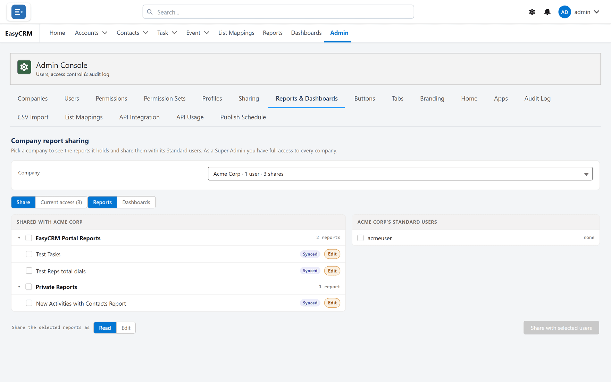

# Reports and Dashboards

**What it is.** Who can see which reports and dashboards.

**What it does.** You share a report, a dashboard or a whole folder with a company, or with
chosen people inside it.

**Why it helps.** One company's reports stay out of another's sight, and you set it once
rather than report by report.

## Opening it

**Where:** **Admin** → **Reports & Dashboards**

1. Click **Admin** in the top menu.
2. Click **Reports & Dashboards** in the row of tabs.

## Sharing something

**Where:** **Admin** → **Reports & Dashboards** → **Share**

1. Find the report, dashboard or folder in the list.
2. Click **Share**.
3. Choose the company.
4. Choose the access:

| Access | Lets them |
|---|---|
| **Read** | Open it and run it. |
| **Edit** | Open it and change it. |

5. Click **Save**.

Give **Read** unless somebody has asked to change the report. **Edit** means they can change
it for everybody it is shared with.

## Sharing with particular people

Sometimes a whole company is too broad.

1. Click **Share** on the item.
2. Choose the people instead of the company.
3. Click **Share with selected users**.

## Seeing who has access now

Each item shows **Current access** with a count. Click it to see exactly which companies and
people, and what level each has.

## Taking access away

1. Open **Current access** for the item.
2. Remove the company or person.

They lose it immediately. Anything they built on top of it stays theirs.

## Folders versus single reports

Sharing a **folder** shares everything in it, including anything added later. Sharing a single
**report** shares only that one.

Use folders for a set that belongs together — it is less work and less likely to be forgotten
when somebody adds the next report.
