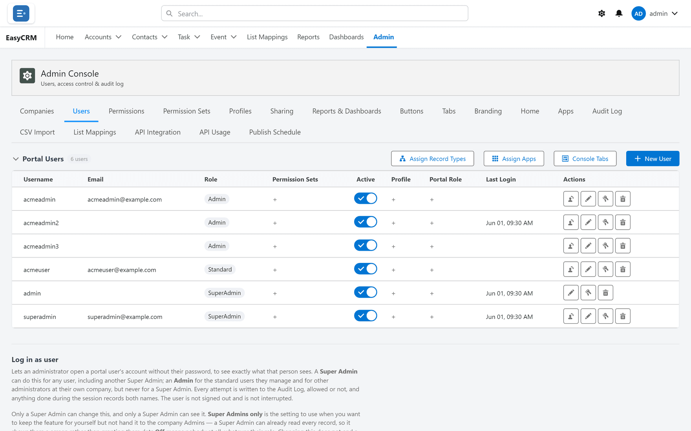

# The Admin Console

**What it is.** The single place everything about running the portal is managed.

**Who sees it.** Only Admins and Super Admins. For everybody else the **Admin** tab does not
appear at all.

## Opening it

**Where:** **Admin** in the top menu

1. Click **Admin** in the row of tabs across the top of the screen.
2. The console opens.

Under the heading is a row of tabs — eighteen of them, wrapping onto a second line. Each one
is a separate area. Click a tab to open it.

## What each tab is for

| Tab | What you do there |
|---|---|
| [Companies](./companies/index.md) | Set up the companies whose people use the portal. |
| [Users](./users/index.md) | Add people, set their role, reset passwords. |
| [Permissions](./access/permissions.md) | Decide what each role may do with records. |
| [Permission Sets](./access/permission-sets.md) | Bundle extra access and hand it to individuals. |
| [Profiles](./access/profiles.md) | Set the starting access for a kind of person. |
| [Sharing](./sharing/index.md) | Decide who can see whose records. |
| [Reports and Dashboards](./data/report-folders.md) | Share report folders between companies. |
| [Buttons](./appearance/buttons.md) | Add your own buttons to record pages. |
| [Tabs](./appearance/tabs.md) | Choose which tabs appear, and in what order. |
| [Branding](./appearance/branding.md) | Set the portal name, logo and colours. |
| [Home](./appearance/home.md) | Choose what everybody sees on the home page. |
| [Apps](./appearance/apps.md) | Group tabs into apps. |
| [Audit Log](./operations/audit-log.md) | See who did what. |
| [CSV Import](./data/csv-import.md) | Load records from a spreadsheet. |
| [List Mappings](./data/list-mappings.md) | Line up incoming columns with your fields. |
| [API Integration](./data/api-integration.md) | Let another system read your data. |
| [API Usage](./data/api-usage.md) | See how much the API is being used. |
| [Publish Schedule](./data/publish-schedule.md) | Send reports to Salesforce on a timetable. |

## Two more areas that are not tabs here

- [Page layouts](./layouts/index.md) — reached from a record, not from this console.
- [The sign-in page](./appearance/login-design.md) — reached from **Branding**.

## Who sees which tabs

A **Super Admin** sees all eighteen.

An **Admin** sees only the ones a Super Admin has allowed for their company. That is set under
[Users](./users/index.md), with the **Console Tabs** button.

## Where to start on a new portal

1. [Companies](./companies/index.md) — create the company first; users belong to one.
2. [Users](./users/index.md) — add people.
3. [Permissions](./access/permissions.md) — decide what each role may do.
4. [Sharing](./sharing/index.md) — decide which records they may do it to.
5. [Tabs](./appearance/tabs.md) and [Branding](./appearance/branding.md) — make it look right.

Steps 3 and 4 are the pair people most often get half-right. Both are needed.
