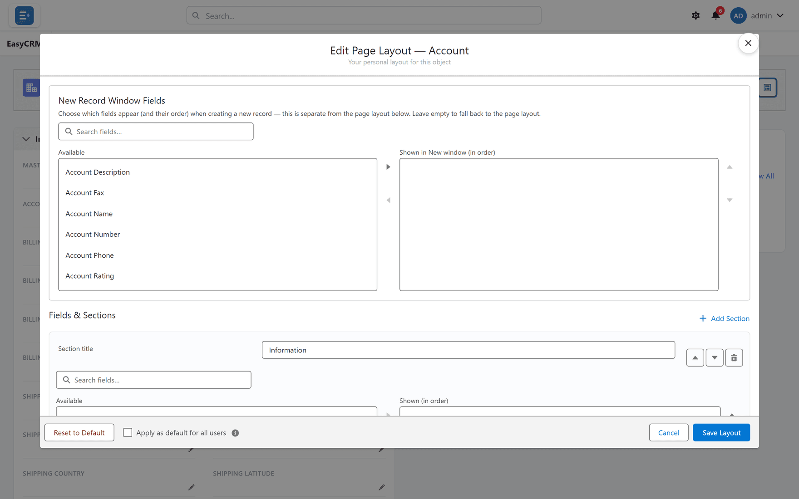
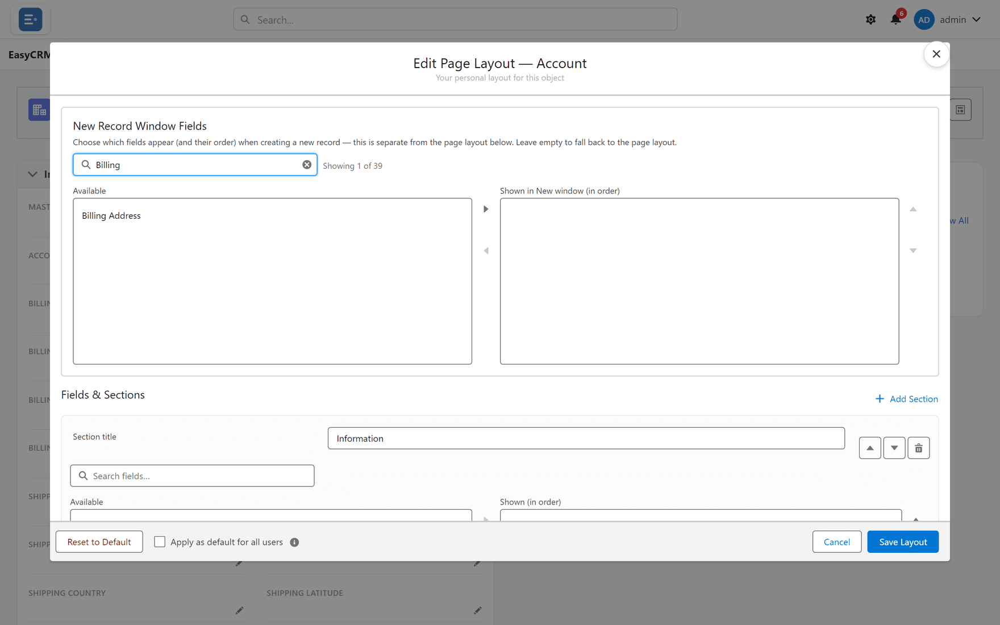

# Choosing fields

## What you are deciding

Which fields appear on a record page, in what order — **for everybody** who sees that kind of
record, not just you.

## Opening the editor

**Where:** **Accounts** → any record's name → **Edit Page Layout**

It is reached from a record, not the Admin Console. Any record of that kind will do — the
layout applies to all of them.

## Moving fields

Two lists sit side by side:

- **Available** — fields not on the page
- **Shown (in order)** — the fields on the page, top to bottom

| To | Do |
|---|---|
| Add a field | Click it on the left, then **Move selection to Shown (in order)** |
| Remove one | Click it on the right, then **Move selection to Available** |
| Reorder | Click it on the right, then **Move selection up** / **down** |

## Finding a field among hundreds

Click **Search fields…** and type part of the name.

Fields you have already chosen stay on the right while you search, so searching can never lose
your work.

## How many fields to show

Fewer than you think. A layout is a reading surface, and every field you add makes the ones
that matter harder to find.

| Guide | Why |
|---|---|
| Lead with identity | Name, owner, status — what tells you which record this is |
| Then what people act on | The handful that change regularly |
| Then everything else, in a section | Collapsed, available, out of the way |
| Leave off what nobody reads | It is still on the record; it is just not displayed |

## Removing a field never deletes data

The value stays on the record and remains available to [reports](../../use/reports/index.md)
and the [API](../data/api-integration.md). It is only hidden from this page.

That makes removing fields low-risk and reversible — the opposite of deleting one.

## What goes wrong

| Symptom | Cause |
|---|---|
| A field is missing from **Available** | It does not exist on that object, or you lack permission for it. |
| Your change did not appear | **Save Layout** was not clicked, or people need to reload. |
| Somebody still cannot edit a field | Layout shows a field; **Editable Fields** permission decides if they may change it. |

That last row is the common confusion: putting a field on a layout does **not** grant edit
access. See [Permissions](../access/permissions.md).

## Where this fits

Fields are one of four things a layout controls, alongside
[sections](./sections.md), [related lists](./related-lists.md) and the
[new-record window](./new-record-window.md).
