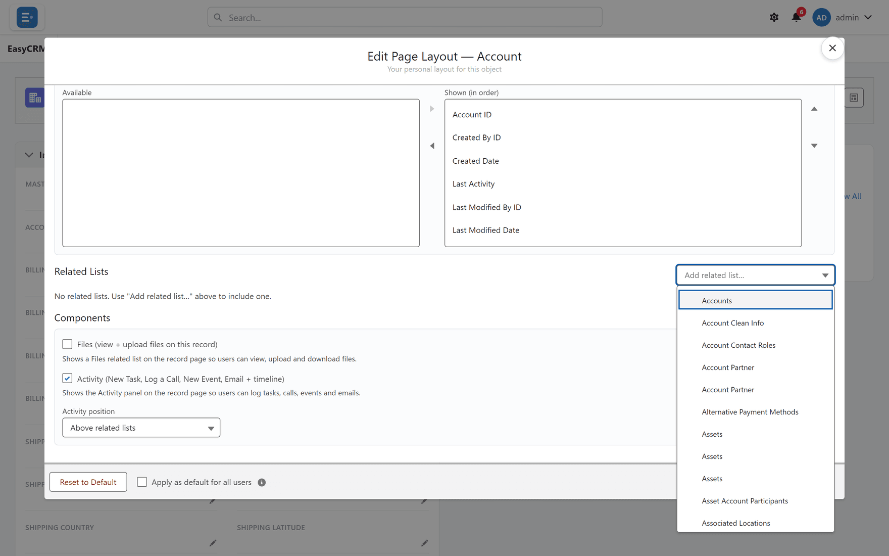

# Related lists

## What they are

The tables at the bottom of a record showing other records linked to it — the contacts at an
account, the tasks on a contact.

## Why they matter

They are how somebody moves between connected records without searching. An account page with
no contacts list forces every user to go to Contacts and filter, every time.

## Adding one

**Where:** the layout editor → **Related Lists** → **Add related list…**

1. Open the layout editor from any record.
2. Scroll to the **Related Lists** area.
3. Click the **Add related list…** box.

   

4. Choose which records it should show.
5. Click **Save Layout**.

## Where the activity panel sits

**Above related lists** controls whether the calls-and-tasks panel appears before or after
them.

Above is usually right: activity is what most people came for, and related records are
reference.

## Which lists to include

| Include | Because |
|---|---|
| The obvious children | Contacts on an account, tasks on a contact |
| Anything people currently search for | That search is a missing related list |

| Leave off | Because |
|---|---|
| Lists that are always empty | They teach people to ignore the area |
| Everything available | The page becomes a directory |

## Permission still applies

A related list only shows records the reader is allowed to see. Two people on the same record
can legitimately see different numbers of related records — see
[Sharing](../sharing/index.md).

If somebody reports an empty related list, check their access before changing the layout.

## What goes wrong

| Symptom | Cause |
|---|---|
| The list is missing for some users | They lack permission for that object. |
| It is empty | Nothing is linked yet — not a fault. |
| It shows the wrong columns | Columns are set per related list in the editor. |

## Where this fits

Related lists sit below [sections](./sections.md) on the same layout. What a *new* record asks
for is separate — see [The new-record window](./new-record-window.md).
