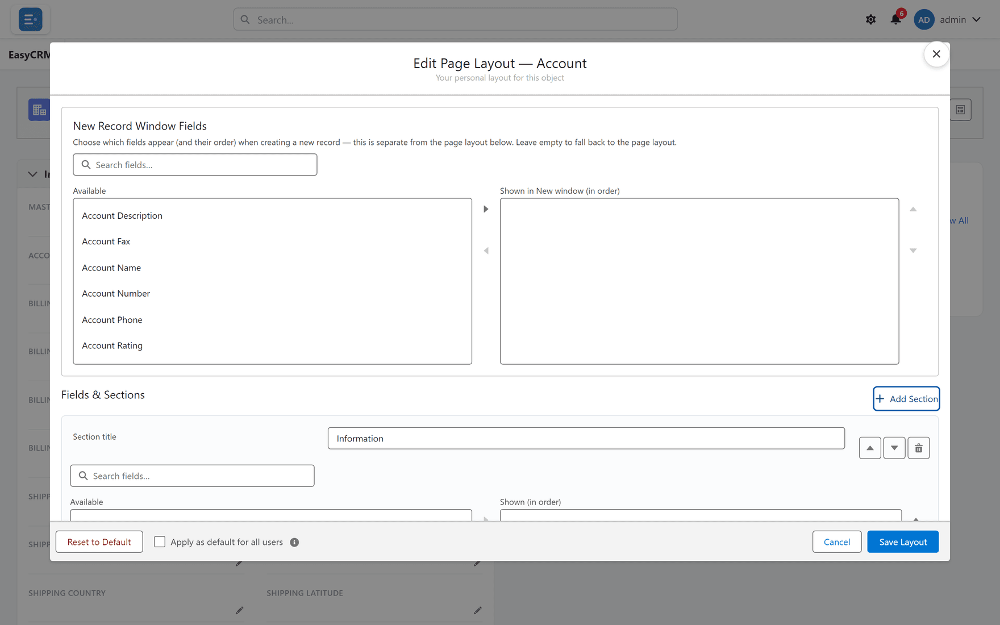

# Sections

## What a section is

A heading with fields grouped under it. Readers can fold a section away, so sections are how a
long record page stays readable.

## When to add one

When a layout passes about a dozen fields. Below that, grouping adds ceremony without helping;
above it, an ungrouped wall of fields is genuinely hard to read.

## Adding one

**Where:** the layout editor → **Add Section**

1. Open the layout editor from any record.
2. Click **Add Section**.

   

3. Give it a name.
4. Move fields into it.

Use **Move section up** / **down** to reorder, and **Remove section** to delete one.

**Removing a section does not delete its fields or any data.**

## Naming sections

Name them for what the reader is looking for, not for where the data came from.

| Good | Poor |
|---|---|
| Billing | Address Information 2 |
| Contract | Custom Fields |
| System information | Misc |

## A section order that works

1. **Information** — identity and the fields people act on
2. **Billing / Contract / whatever your business needs**
3. **System information** — created, modified, ids. Last, and usually collapsed

Putting system fields first is the most common layout mistake. Nobody opens a customer record
to find out when it was created.

## What goes wrong

| Symptom | Cause |
|---|---|
| A section is empty on some records | Its fields are empty for those records. |
| Sections are not in the order you set | **Save Layout** was not clicked. |
| A section cannot be removed | Some built-in sections are fixed. |

## Where this fits

Sections organise the [fields](./fields.md) you chose. [Related lists](./related-lists.md) sit
below them.
