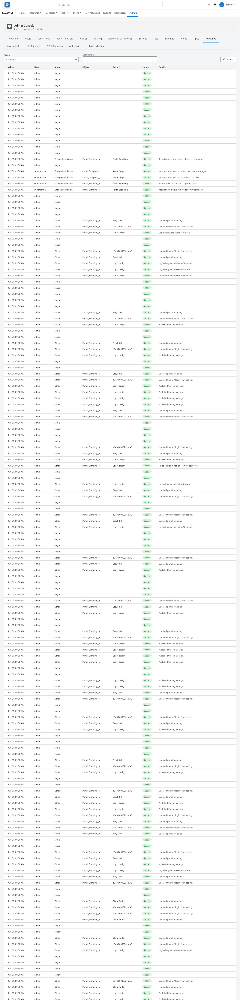
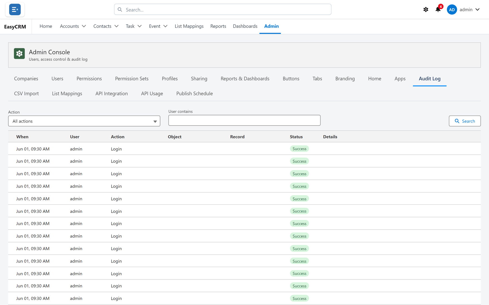

# Audit Log

**What it is.** A record of who did what, and when.

**What it does.** It writes down sign-ins, failed sign-ins, password changes and
administration changes, newest first.

**Why it matters.** It cannot be edited or deleted by anybody, including a Super Admin. That
is the point of it: it is evidence, not a convenience.

## Opening it

**Where:** **Admin** → **Audit Log**

1. Click **Admin** in the top menu.
2. Click **Audit Log** in the row of tabs.

Each row shows who did it, what they did, and when.

## Narrowing it down

**Where:** **Admin** → **Audit Log** → **All actions** / **Search**

1. Click the **All actions** box to filter by the kind of action.

   

2. Or type into **Search** to find a person or a record.

Both work together, so you can look for one kind of action by one person.

## What gets recorded

| Action | Why it is kept |
|---|---|
| Sign-in | Who was in, and when. |
| **Failed** sign-in | Repeated failures on one account are worth noticing. |
| Password change or reset | Who changed whose. |
| Administration changes | Permissions, sharing, users. |
| Logging in as another person | Both names, every time. |

## Logging in as somebody else

This is recorded particularly carefully. Every attempt is written down, **allowed or refused**,
and anything done during that session records both names — the person acting and the person
whose account it was.

So the log always answers "who really did this?", not just "whose account was it?".

## What you cannot do

You cannot edit a row, delete a row, or turn the log off. If that were possible the log would
be worthless.

## When to look at it

- Somebody says they did not make a change.
- You want to know who last changed a setting.
- An account shows repeated failed sign-ins.
