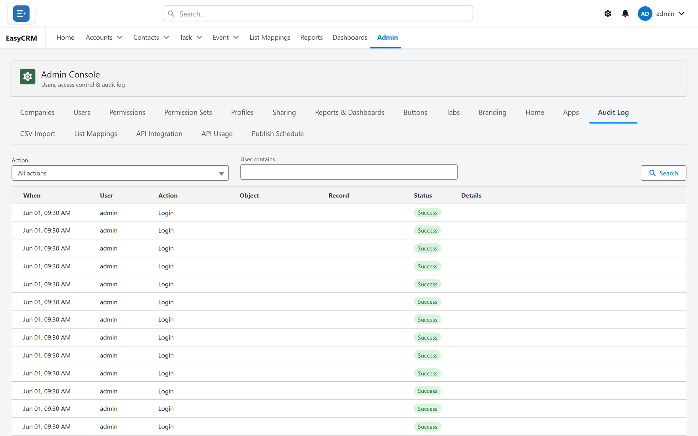

# Audit Log

## What it is

A record of who did what, and when. It cannot be edited, deleted or switched off by anybody,
including a Super Admin.

That immutability is the whole point. A log an administrator can alter is not evidence.

## When you will use it

| Situation | What the log answers |
|---|---|
| "I didn't change that" | Who did, and when |
| A setting changed and nobody knows why | Which admin, which day |
| Repeated failed sign-ins | Whether somebody is being targeted |
| Reviewing support access | Who viewed the portal as somebody else |

## Opening it

**Where:** **Admin** → **Audit Log**

1. Click **Admin** in the top menu.
2. Click **Audit Log** in the row of tabs.

Newest first. Each row shows who, what and when.

## Narrowing it

1. Click **All actions** to filter by the kind of action.

   

2. Or type into **Search** to find a person or record.

Both work together, so you can ask for one kind of action by one person.

## What is recorded

| Action | Kept |
|---|---|
| Sign-in | Who and when |
| **Failed** sign-in | Repeated failures on one account are worth noticing |
| Password change or reset | Who changed whose |
| Administration changes | Permissions, sharing, users |
| Viewing the portal as somebody else | **Both** names, allowed or refused |

## That last row, in detail

Support impersonation is logged more carefully than anything else:

- Every **attempt** is recorded, including refused ones.
- Anything done during the session records **both** names — the administrator and the account.

So the log always answers "who really did this?", not just "whose account was it?". See
[Seeing the portal as somebody else](../users/login-as.md).

## How to use it when something looks wrong

1. Filter by the **kind** of action first — it cuts the volume fastest.
2. Then narrow to the person or the day.
3. Read the surrounding rows, not just the one you were looking for. Changes come in clusters,
   and the row before often explains the row you found.

## What it does not tell you

It records **administrative** actions and access, not every field change on every record. If
you need to know who changed one field on one account, that is record history in Salesforce,
not this.

## What goes wrong

| Symptom | Cause |
|---|---|
| An action you expected is missing | Not every action is audited — record edits are not. |
| Too many rows | Filter by action kind before searching. |
| You cannot delete an entry | Correct, and deliberate. |

## Where this fits

The audit log is the record of what the rest of the Admin Console did. It is the first place to
look when a setting changed and nobody owns up.
