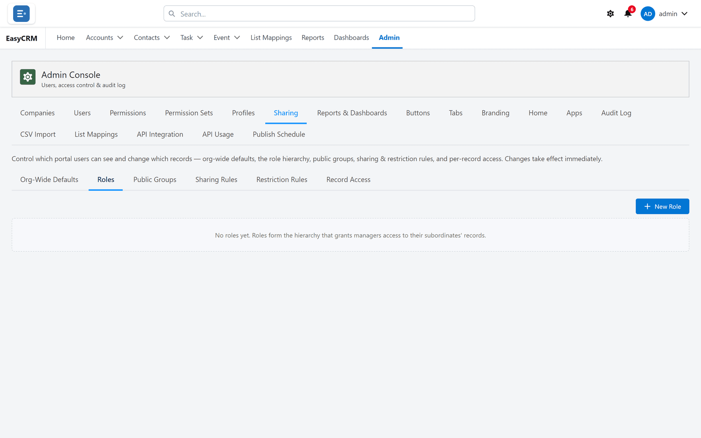

# Roles

**What it is.** A tree showing who reports to whom.

**What it does.** It records the management line, and lets access flow up it.

**Why it helps.** With **Grant via Hierarchy** on, a manager automatically sees what their
people see. You never have to build a rule for each manager, or remember to update one when
the team changes.

## Opening it

**Where:** **Admin** → **Sharing** → **Roles**

1. Click **Admin** in the top menu.
2. Click **Sharing**, then **Roles**.

## Creating a role

1. Click **New**.
2. Name the role after the job, such as "Sales Manager".
3. Choose which role it **Reports To**. Leave it empty for the top of the tree.
4. Click **Save**.

Build from the top down, so the role you need to report to already exists.

## Putting people in roles

**Where:** **Admin** → **Users** → the person's row → **Set portal role**

1. Click **Admin**, then **Users**.
2. Find the person.
3. Click **Set portal role** in their row and choose the role.

## How access flows

Access flows **upwards only**. A manager sees what their people see. The people do not see
what their manager sees.

This only happens if **Grant via Hierarchy** is on for that kind of record — see
[Who sees what, by default](./defaults.md).

## Roles are not permissions

This catches people out, so it is worth being plain about:

| Thing | Decides |
|---|---|
| **Role** | Whose records you can see. |
| [Profile](../access/profiles.md) / [permissions](../access/permissions.md) | What you may do with them. |

Somebody can be at the top of the hierarchy and still unable to delete anything. The two are
deliberately separate.

## Keeping it current

When somebody changes job, change their role. If you do not, their old manager keeps seeing
their records and their new one does not.
