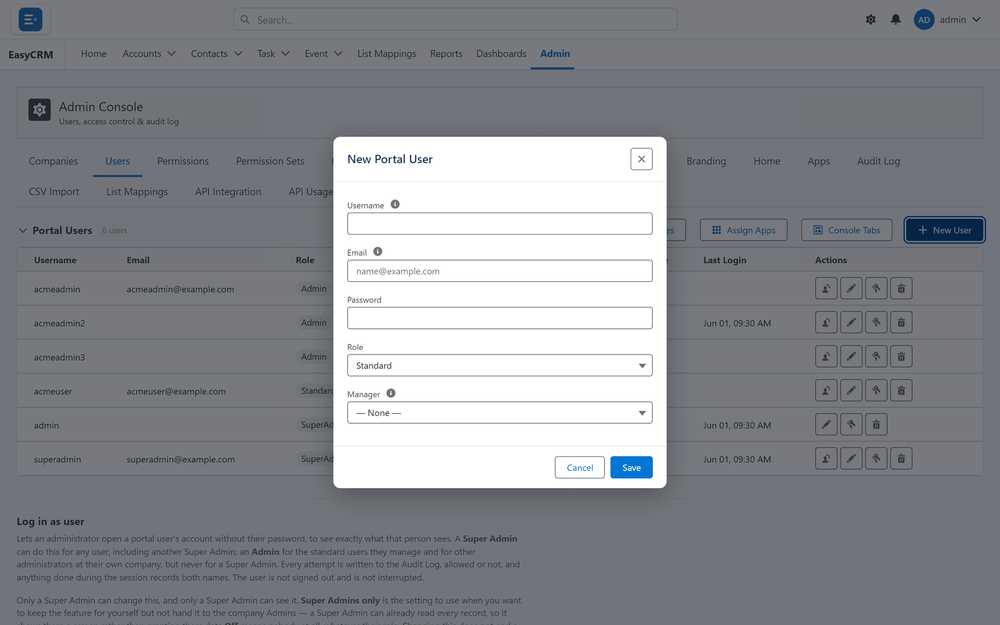

# Adding a user

## Before you start

Create the person's [company](../companies/index.md) first. Company drives most access rules,
and a user created without one is the most common setup mistake in the product.

## Adding somebody

**Where:** **Admin** → **Users** → **+ New User**

1. Click **Admin** in the top menu.
2. Click **Users** in the row of tabs.
3. Click the blue **+ New User** button on the right.

   

4. Fill in each field:

| Field | Notes |
|---|---|
| **Username** | What they type to sign in. Must be unique across the portal. |
| **Email** | Where their password is sent. Must be real and reachable. |
| **Role** | See below. |
| **Company** | Always set this. |

5. Click **Save**.

The password is generated and emailed automatically. You never see it, and neither does anybody
else.

## Choosing the role

| Role | Can | Give it to |
|---|---|---|
| **Standard** | See and work on their own records | Most people |
| **Admin** | The above, plus manage people at their own company | One or two per company |
| **Super Admin** | Everything, for every company | Whoever runs the portal |

**Be sparing with Super Admin.** It crosses company boundaries, which is precisely what the
rest of the model exists to prevent.

## Why the company field matters so much

A blank company matches no company rule. The symptoms are confusing and rarely point at the
cause:

- Their Admin cannot see or manage them.
- Report folders shared with their company do not appear.
- Apps assigned to their company do not appear.

All three are the same missing field.

## After creating them

A new user has a role and a company but no specific access yet. Decide:

| Next | Page |
|---|---|
| What they may do | [Permissions](../access/permissions.md) |
| Which records they may do it to | [Sharing](../sharing/index.md) |
| Whether they are tied to one account | [Account scoping](../sharing/account-scoping.md) |

## What goes wrong

| Symptom | Cause |
|---|---|
| "Username already exists" | Usernames are unique portal-wide, including inactive users. |
| No welcome email | Check spam; then check email deliverability in [Setup Assistant](../operations/setup-assistant.md). |
| They sign in but see nothing | Permissions without sharing. |
| Save is refused | You may have hit a [licence limit](../operations/licence.md). |
