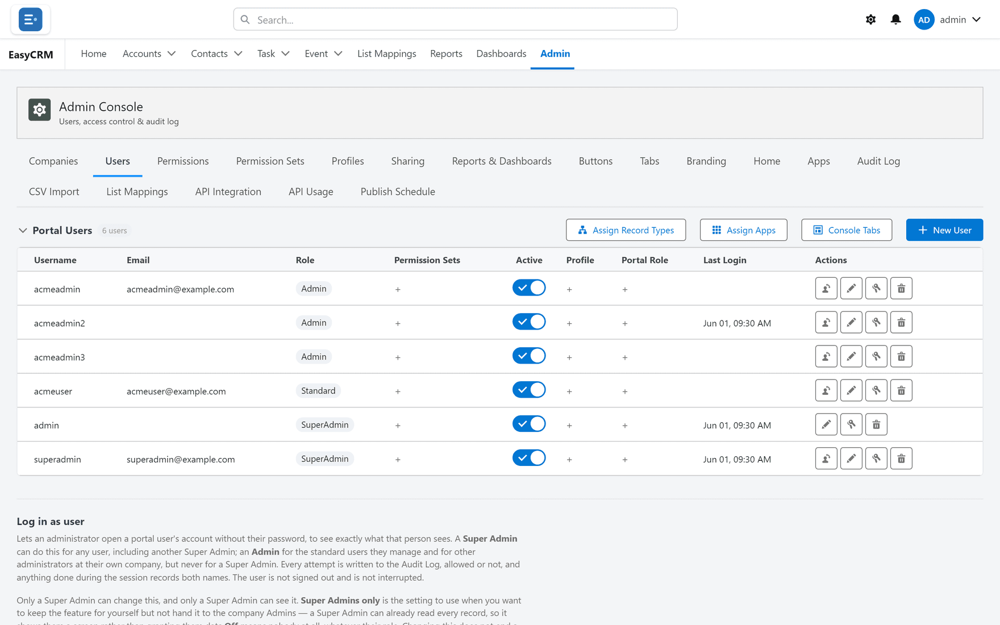

# Users

**What it is.** Everybody who can sign in to the portal.

**What you do here.** Add people, set what kind of user they are, reset passwords, and switch
off anybody who has left.

**Why it matters.** This is the front door. Somebody switched off here cannot get in at all,
whatever any other setting says.

## In this section

| Page | Covers |
|---|---|
| [Adding a user](./adding.md) | Creating somebody, choosing their role |
| [When somebody leaves](./deactivating.md) | Deactivating, and what to do with their records |
| [Seeing the portal as somebody else](./login-as.md) | Reproducing a reported problem |

## Opening it

**Where:** **Admin** → **Users**

1. Click **Admin** in the top menu.
2. Click **Users** in the row of tabs under the heading.

Every person who can sign in is listed, with their username, email, role, whether they are
active, and when they last signed in.

## Adding somebody

**Where:** **Admin** → **Users** → **+ New User**

1. Click **Admin**, then **Users**.
2. Click the blue **+ New User** button on the right.
3. A window opens.

   

4. Fill in:
   - **Username** — what they type to sign in. It must be unique.
   - **Email** — where their password is sent. It must be real.
   - **Role** — see the table below.
   - **Company** — which company they belong to. Always set this.
5. Click **Save**.

They are emailed a password automatically.

### Which role to choose

| Role | Can do |
|---|---|
| **Standard** | See and work on their own records. Most people. |
| **Admin** | The above, plus manage people at their own company. |
| **Super Admin** | Everything, for every company. Keep this to a few people. |

### Always set a company

Somebody with no company is not treated as a match for any company rule. They may end up
seeing nothing, or being invisible to their own Admin. It is the single most common setup
mistake.

## When somebody leaves

**Do not delete them.** Switch them off instead.

1. Find them in the list.
2. Click the **Active** switch so it turns grey.

They can no longer sign in. Their records, and the history of what they did, stay exactly as
they are. Deleting would break both.

## Resetting a password

1. Find the person in the list.
2. Click the **key** symbol in the **Actions** column.
3. Click **Save**.

A new password is emailed to them. You never see it, and neither does anybody else.

## Seeing the portal as somebody else

Useful when a colleague reports a problem you cannot reproduce.

1. Find the person in the list.
2. Click the **person** symbol in the **Actions** column.

You now see the portal exactly as they see it. A banner shows whose account you are in.

**What you should know:**

- Every attempt is written to the [Audit Log](../operations/audit-log.md), allowed or refused.
- Anything you do while in there records both names.
- The person is not signed out and does not notice.

**Who may do it:** a Super Admin for anyone. An Admin for the Standard users they manage and
for other Admins at their own company — never for a Super Admin.

This is switched off until a Super Admin turns it on.

## The three buttons above the table

These set things for the **whole company**, not one person.

| Button | What it controls |
|---|---|
| **Assign Apps** | Which apps the company's people can switch between. |
| **Assign Record Types** | Which kinds of record they may create. |
| **Console Tabs** | Which Admin Console tabs their Admins can see. |

**Assign Apps** decides what appears in the app launcher.

**Assign Record Types** decides what the **New** button offers.

Leaving a list blank usually means "all of them", not "none".
