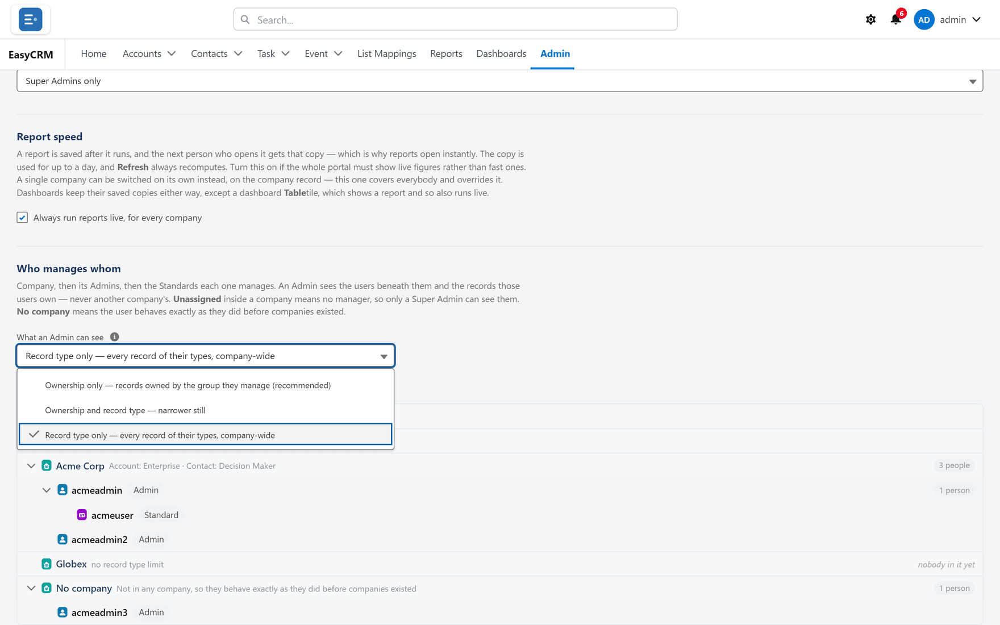
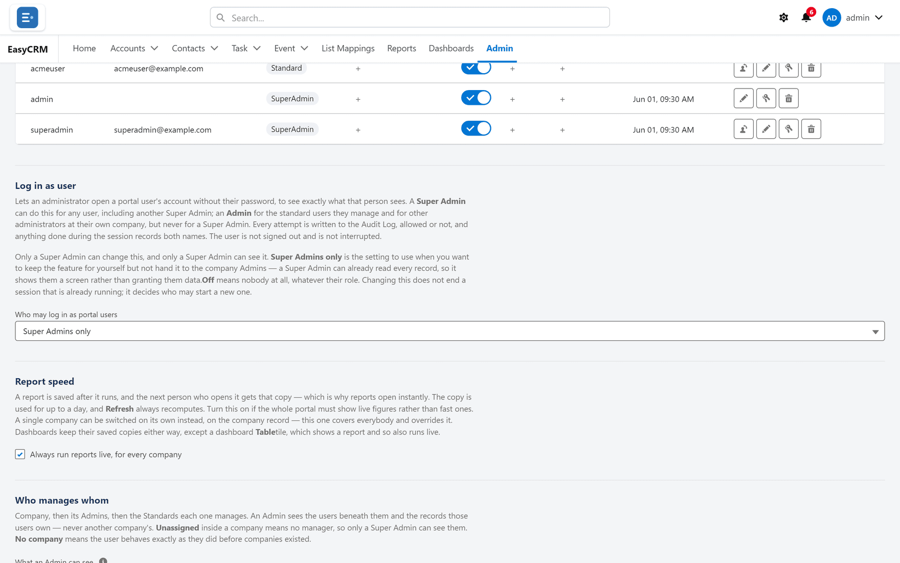

# What an Admin can see

## What this setting is

One setting, with three modes, deciding which **records** every Admin in the portal reaches.

It is **not** about permissions — an Admin's read, create and edit rights are set separately in
[Permissions](../access/permissions.md). This decides which records those rights apply to.

## Why it exists

By default an Admin sees the records owned by the people they manage. That is usually right,
but not always:

- Some companies want an Admin narrowed further, to one kind of record.
- Some want an Admin to see **every** record of a particular kind, across the whole company,
  regardless of who owns it.

The three modes cover those cases.

## Only a Super Admin can change it

Deliberately. The setting decides how much **every** Admin can see, so letting an Admin change
it would let them widen their own access — and one of the modes reaches outside their group
altogether.

Changing it is written to the [Audit Log](../operations/audit-log.md) as a permission change.

## Where it is

**Where:** **Admin** → **Users** → scroll to **Who manages whom** → **What an Admin can see**

## The three modes

| Mode | An Admin sees | Effect |
|---|---|---|
| **Ownership only** | Records owned by the group they manage | The default. Recommended |
| **Ownership and record type** | Owned by their group **and** of a record type they are assigned | Narrower still |
| **Record type only** | Every record of their types, **company-wide, any owner** | **Wider** — reaches outside their group |

### Ownership only — the default

An Admin sees records owned by their group: themselves, the users they manage, and the Standard
users at their company.

**Needs nothing configured.** It is the only mode that works correctly out of the box, which is
why it is both the default and the recommendation.

### Ownership and record type

Both tests must pass: owned by their group **and** of a record type assigned to them.

On an object that has **no** record types, the type test cannot fail anybody — so this collapses
to ownership rather than blinding the Admin entirely. That is deliberate; the alternative would
be an Admin who suddenly sees nothing on objects you never set up record types for.

### Record type only — the one that widens

An Admin sees every record of a record type assigned to them, **whoever owns it**.

:::warning
This is the only mode that reaches **outside** the group an Admin manages. It **widens** their
access rather than restricting it.

An Admin under this mode can see records belonging to people they do not manage — including
other teams at the same company — as long as the record type matches.
:::

Use it when an Admin is genuinely responsible for a *kind* of record rather than a group of
people. A support lead who should see every support case, no matter who owns it, is the case it
exists for.

## Choosing

Work down this list and stop at the first that fits.

1. **Ownership only.** Start here. It needs nothing configured and is the safe answer.
2. **Ownership and record type**, if an Admin should be restricted to one kind of record even
   within their own group.
3. **Record type only**, *only* if an Admin is responsible for a record type across the whole
   company — and you have confirmed that is intended.

## Testing after a change

The setting applies to **every** Admin at once, so check before you rely on it.

1. Pick an Admin and a record owned by somebody they do **not** manage.
2. Open [Record access](../sharing/record-access.md) on that record.
3. Confirm the Admin is listed — or not — as you intended.

Under **Record type only**, expect them to appear. If that surprises you, the mode is wrong.

## What goes wrong

| Symptom | Cause |
|---|---|
| An Admin suddenly sees far more | Switched to **Record type only**, which widens. |
| An Admin sees nothing on one object | **Ownership and record type**, with no matching type assigned. |
| A list is empty but a record opens fine | Older builds could disagree between the two. Re-check the mode. |
| The change had no effect | The setting is cached. Reload; if it persists, check the audit log recorded it. |

## The two settings beside it

The same screen carries two more settings that belong to a Super Admin.

### Who may log in as portal users

Controls [support impersonation](./login-as.md). **Super Admins only** keeps the feature without
handing it to company Admins. **Off** means nobody, whatever their role.

Changing it does not end a session already running — it decides who may start a new one.

### Report speed

A report is saved after it runs, and the next person to open it gets that copy — which is why
reports open instantly. The copy is used for up to a day, and **Refresh** always recomputes.

Tick **Always run reports live, for every company** when the portal must show live figures
rather than fast ones.

| | |
|---|---|
| Scope | Everybody. A single company can be switched on its own on the company record; this one overrides it |
| Dashboards | Keep their saved copies either way — except a **Table** tile, which shows a report and so also runs live |

Turning it on makes every report slower for everybody. Switch one company instead if only one
needs it.

## Where this fits

This setting narrows or widens what an Admin reaches **after**
[permissions](../access/permissions.md) decide what they may do, and alongside
[sharing](../sharing/index.md), which governs everybody. When they disagree,
[Record access](../sharing/record-access.md) names the winner.
