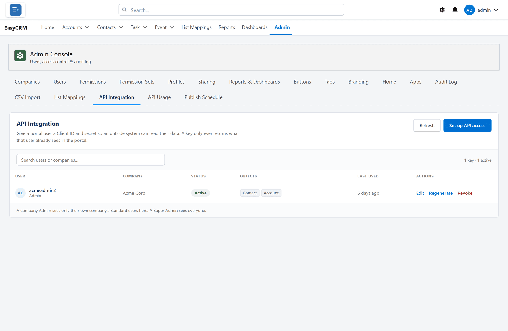
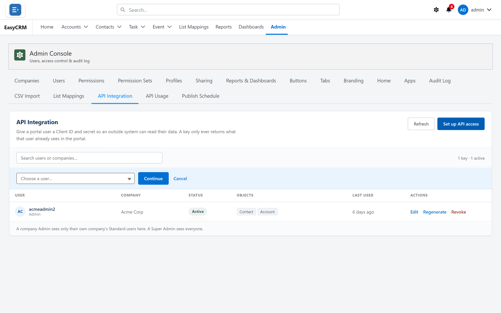

# API Integration

**What it is.** A way to let another system read your portal data automatically.

**What it does.** You create a key, choose exactly what it may read, and give it to whoever is
building the other system.

**Why it is safe.** Keys can only **read**. Nothing can be changed or deleted through them, so
the worst a leaked key can do is show somebody data — not alter it.

## Opening it

**Where:** **Admin** → **API Integration**

1. Click **Admin** in the top menu.
2. Click **API Integration** in the row of tabs.

Everybody who currently holds a key is listed.

## Creating a key

**Where:** **Admin** → **API Integration** → **Set up API access**

1. Click **Admin**, then **API Integration**.
2. Click **Set up API access**.

   

3. Choose the person the key belongs to. The key sees what that person can see, so choose
   somebody whose access matches what the other system should get.
4. Choose which kinds of record it may read, and which fields.
5. Add filters if it should only see some records.
6. Click **Save**.

## Copy the secret now

When the key is created, the **Secret** is shown **once**.

Copy it immediately and give it to whoever needs it, through something secure. If it is lost,
you cannot look it up — you have to **Regenerate**, which produces a new secret and stops the
old one working.

## Giving a key less, not more

Two habits worth keeping:

- Attach the key to somebody with **only** the access the other system needs. A key on a Super
  Admin can read everything.
- Choose fields deliberately. If the other system needs names and emails, do not give it
  everything else as well.

## Managing an existing key

| Button | What it does |
|---|---|
| **Edit** | Change which records and fields the key may read. |
| **Regenerate** | Issue a new secret. The old one stops working at once. |
| **Revoke** | Switch the key off completely. |

**Regenerate** when a secret may have been seen by the wrong person. **Revoke** when the other
system is being retired.

Either one breaks the other system immediately, so tell whoever runs it first.

## Documentation for developers

The technical documentation — endpoints, paging, filters — is on its own site at
[docs.outboundoperators.com](https://docs.outboundoperators.com).

Send that link to whoever is building the integration. They do not need portal access to read
it.
