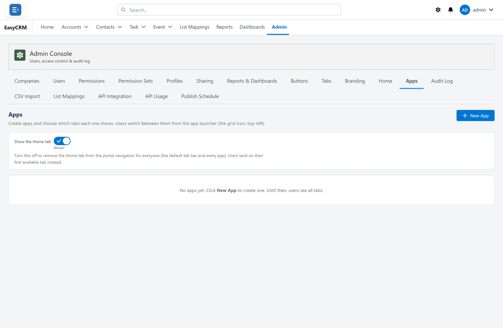

# Apps

Click **Admin**, then **Apps**.

An app is a named group of tabs. People switch between apps from the app launcher, so each
team sees only what it needs.

1. Click **New**.
2. Name the app.
3. Choose its tabs.
4. Click **Save**.

Decide who gets which app under [Users](./users.md), with **Assign Apps**.

Leave the list of companies blank and everybody sees the app.
