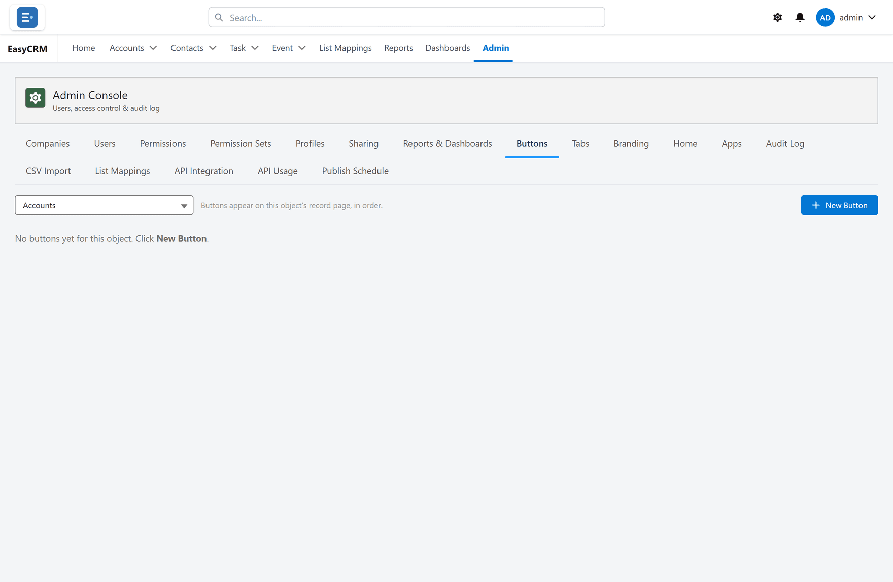

# Buttons

Click **Admin**, then **Buttons**.

You can add your own buttons to record pages, for example to open another system with the
record already loaded.

1. Click **New**.
2. Give the button a label.
3. Choose which kind of record it appears on.
4. Set what it does.
5. Click **Save**.

The button then appears on that kind of record for everybody who can see it.
