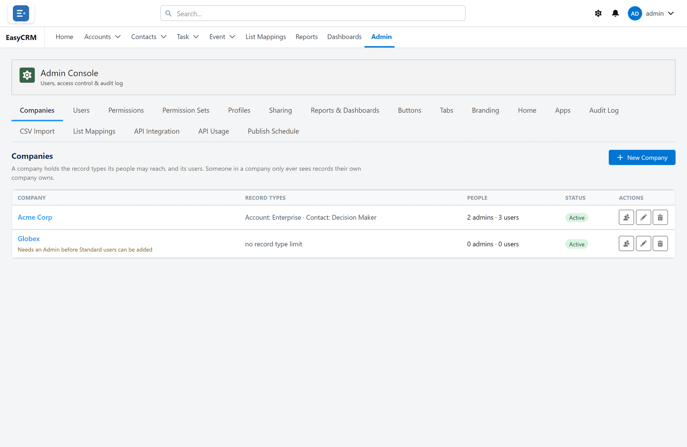
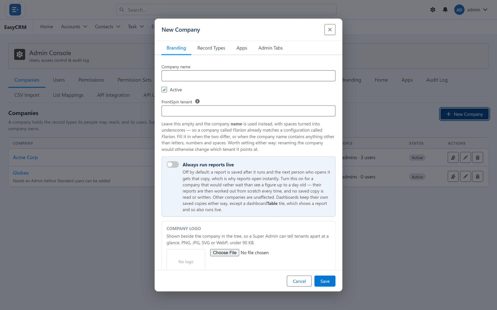

# Companies

Click **Admin**, then **Companies**.

A company groups people together. Everyone who signs in belongs to one.

## Adding a company

1. Click **New Company**.
2. Type a name.
3. Click **Save**.

## Why companies matter

- An **Admin** manages only the people at their own company.
- Report folders can be shared with one company and not another.
- Access to apps and tabs can be set per company.

Somebody with no company set is not treated as a match for any company rule. Always set one.
