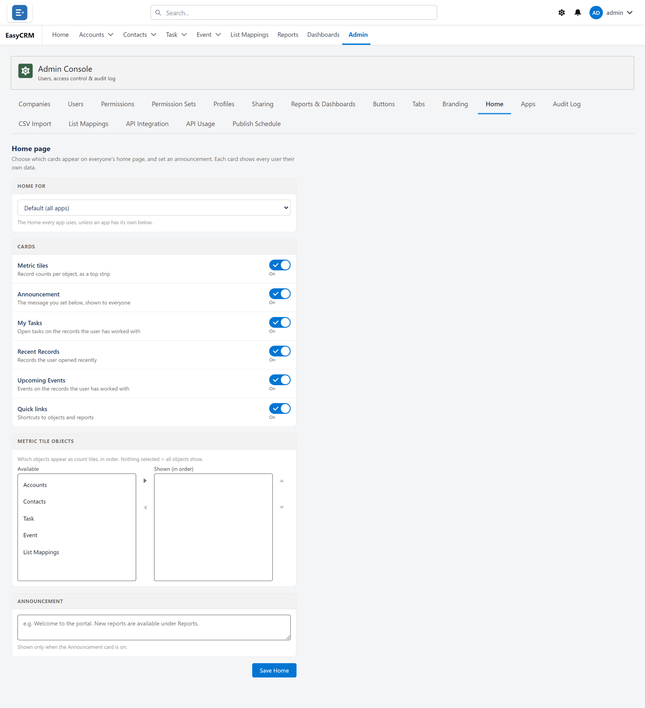

# Home

**What it is.** What everybody sees on the portal's home page.

**What it does.** You choose which cards appear, and in what order.

**Why it helps.** Each card shows every person **their own** data, so one setting suits
everybody. You are choosing the layout, not the contents.

## Opening it

**Where:** **Admin** → **Home**

1. Click **Admin** in the top menu.
2. Click **Home** in the row of tabs.

Be careful not to confuse this with the **Home** tab in the main menu — that is the home page
itself. This one is inside the Admin Console.

## Choosing the cards

The screen has two lists:

- **Available** on the left — cards not currently shown.
- **Shown (in order)** on the right — the cards people see, top to bottom.

1. To add a card: click it on the left, then click **Move selection to Shown (in order)**.
2. To remove one: click it on the right, then click **Move selection to Available**.
3. To reorder: click a card on the right, then **Move selection up** or **Move selection
   down**.
4. Click **Save Home**.

## What each card shows

| Card | Shows |
|---|---|
| **Metric tiles** | Record counts in a strip across the top. |
| **Announcement** | A message you write, shown to everybody. |
| **My Tasks** | That person's open tasks. Overdue ones in red. |
| **Recent Records** | What that person opened recently. |
| **Upcoming Events** | Events on records that person works with. |
| **Quick links** | Shortcuts to each tab. |

## A different home page per app

At the top is a box reading **Default (all apps)**.

1. Leave it on **Default (all apps)** to set the home page everybody gets.
2. Or choose an app to give that app its own home page.

An app with no home page of its own uses the default, so you only set this where a team needs
something different.

## Writing an announcement

1. Make sure **Announcement** is in the **Shown** list.
2. Type your message in the box below.
3. Click **Save Home**.

Everybody sees it on their home page. Clear the text and save again to remove it.
