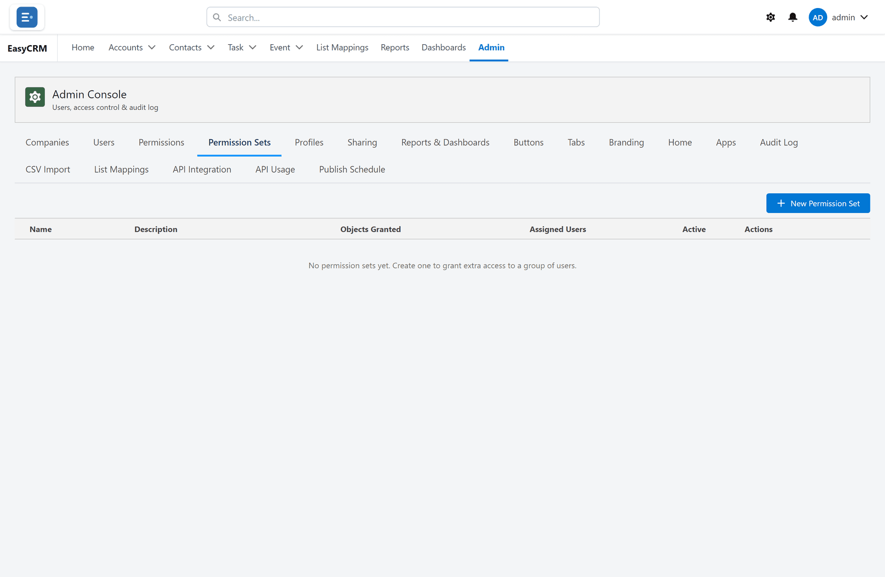

# Permission Sets

Click **Admin**, then **Permission Sets**.

A permission set is a bundle of extra access you give to particular people, on top of what
their role already allows.

Use one when a few people need more than the rest of their role, and you do not want to change
the role for everybody.

## Making one

1. Click **New Permission Set**.
2. Give it a name.
3. Tick what it grants.
4. Click **Save**.

## Giving it to somebody

Open [Users](./users.md) and add the set in the **Permission Sets** column.

A permission set only ever adds access. It can never take any away.
