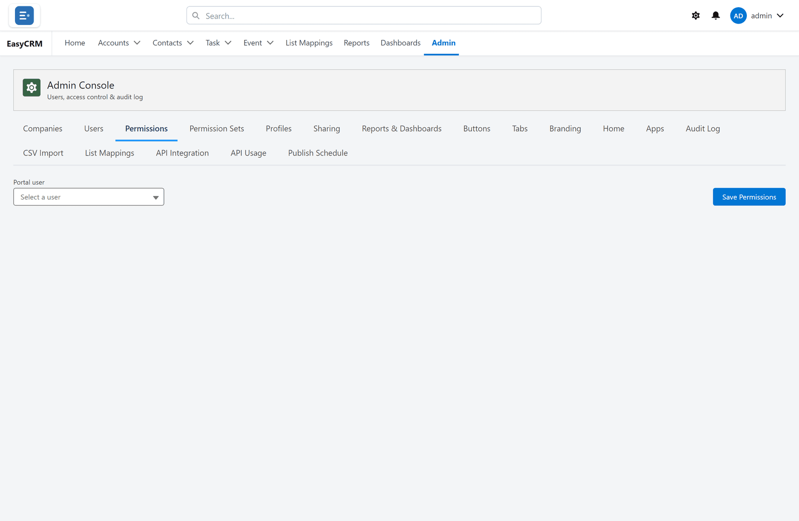

# Permissions

Click **Admin**, then **Permissions**.

This is where you say what each role can do with each kind of record.

For every kind of record you can allow:

| | |
|---|---|
| **Read** | See the records. |
| **Create** | Add new ones. |
| **Edit** | Change existing ones. |
| **Delete** | Remove them. |

Tick what the role should have, and click **Save**.

## One thing worth knowing

Permissions say what a role can do with the records it can see.
[Sharing](./sharing.md) says which records those are.

Somebody needs both. Read permission with no sharing shows an empty list.
