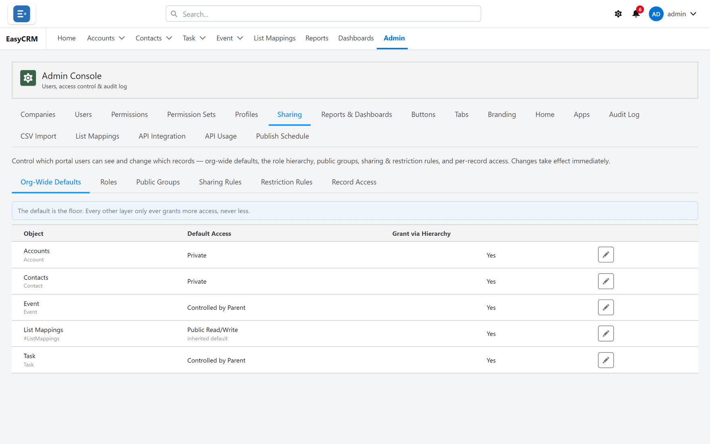

# Public groups

**What it is.** A named list of people.

**What it does.** Nothing on its own. You use it in [sharing rules](./sharing-rules.md) so a
rule can point at a group instead of listing individuals.

**Why it helps.** When somebody joins the team you add them to one group, rather than editing
every rule that should apply to them.

Click **Admin**, then **Sharing**, then **Public Groups**.

## Making one

1. Click **New**.
2. Name it after the people in it, such as "Support Team".
3. Add members.
4. Click **Save**.

## What can be in one

Individual people, roles, and other groups. A group inside a group brings all of its members
with it.

## Naming them

Name a group for **who is in it**, not what it is currently used for. "Support Team" still
makes sense in a year. "Can See Invoices" stops making sense the moment you use it for
something else.
