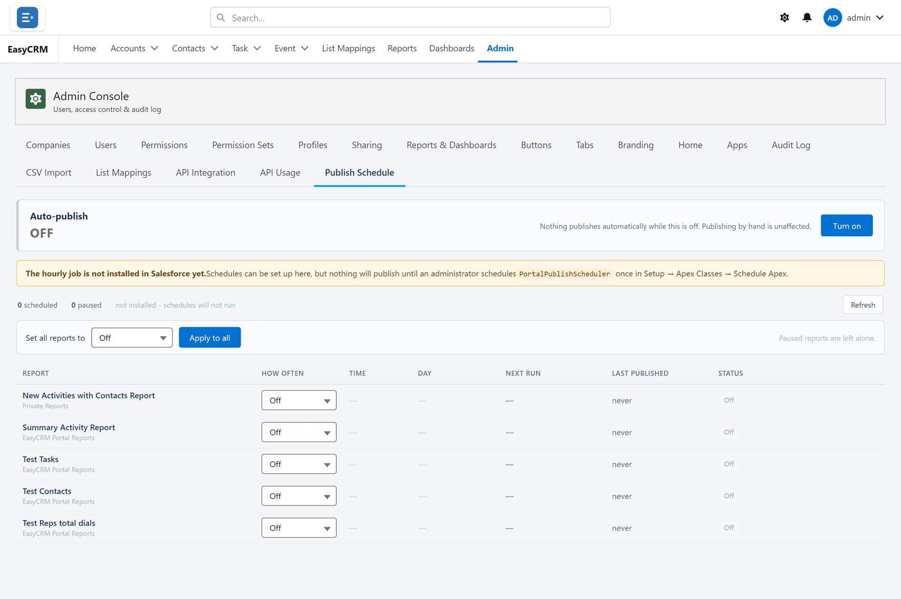

# Publish Schedule

**What it is.** Copying portal reports into Salesforce on a timetable.

**Why it helps.** People who work in Salesforce see the same numbers as people in the portal, without anybody rebuilding the report twice.

Click **Admin**, then **Publish Schedule**.

Portal reports can be copied into Salesforce on a timetable, so people who work in Salesforce
see the same numbers without anybody doing it by hand.

1. Pick a report.
2. Choose how often it should run.
3. Click **Save**.

This is switched off until a Super Admin turns it on.

If a report is deleted, its schedule pauses rather than making a new one.
