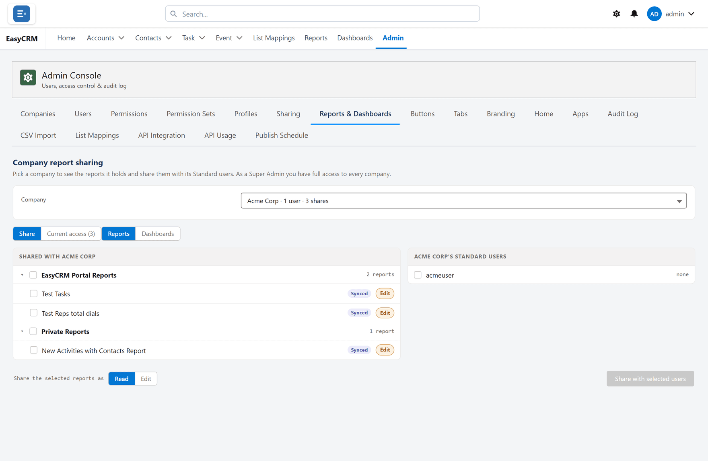

# Reports and Dashboards

**What it is.** Which companies can see which report folders.

**Why it helps.** It is how one company's reports stay out of another's sight, set once per folder rather than report by report.

Click **Admin**, then **Reports & Dashboards**.

This is where you decide which companies can see which report folders.

1. Pick a folder.
2. Choose the companies that should see it.
3. Click **Save**.

People at those companies then find the folder under **Reports**.

A folder shared with nobody is visible only to Super Admins.
