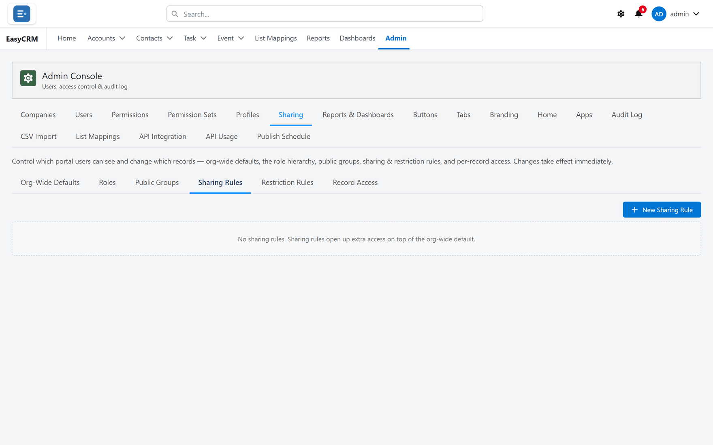

# Sharing rules

**What it is.** A standing rule that opens up access beyond the default.

**What it does.** It says "records like this should also be visible to these people" — and it
keeps applying, to new records as well as old ones.

**Why it helps.** It is how you keep a **Private** default while still letting a team see each
other's work. You set the rule once instead of sharing records one at a time.

Click **Admin**, then **Sharing**, then **Sharing Rules**.

## Making one

1. Click **New**.
2. Choose the kind of record.
3. Choose which records it covers:
   - **Owned by** certain people, or
   - **Matching criteria** — records where a field has a particular value.
4. Choose who to share with: a [public group](./public-groups.md), a role, or a company.
5. Choose the access: **Read** or **Read/Write**.
6. Click **Save**.

## A rule can only add

A sharing rule never takes access away. If somebody can already see a record, no rule here
will hide it. To restrict, use [restriction rules](./restriction-rules.md).

## Turning one off

Set it to **Inactive**. The rule is kept but stops applying, which is safer than deleting it
while you work out whether it was the cause of something.
