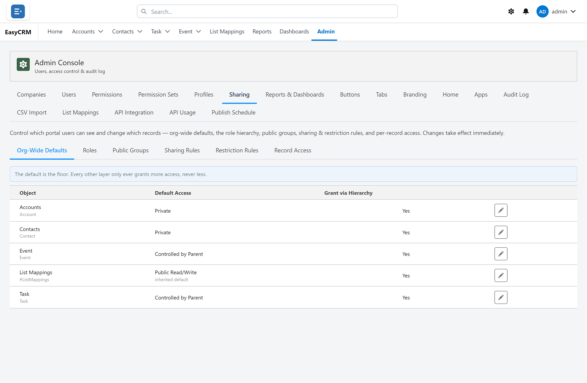

# Sharing

Click **Admin**, then **Sharing**.

Sharing decides which records a person can see. [Permissions](./permissions.md) decide what
they can do with them.

## Start with the default

For each kind of record, choose what everybody gets to begin with:

| Setting | Meaning |
|---|---|
| **Private** | You see only your own records. |
| **Public Read Only** | Everybody can see them. Only the owner can change them. |
| **Public Read/Write** | Everybody can see and change them. |

Start with **Private** and open it up with rules. It is far easier than closing it down later.

## Then add rules

A rule opens up access beyond the default, for example letting a team see each other's
records.

Managers see what the people they manage can see. Set who manages whom under
[Users](./users.md).
