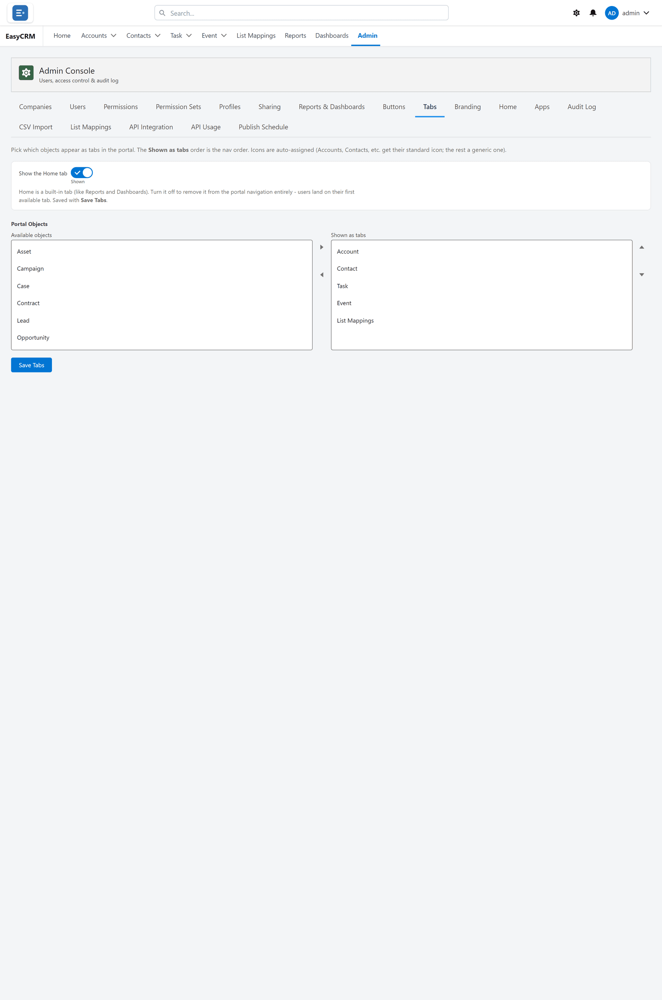

# Tabs

**What it is.** Which tabs appear across the top, and in what order.

**What it is not.** Hiding a tab hides the way in, not the data. Use [Permissions](./permissions.md) and [Sharing](./sharing.md) to control access.

Click **Admin**, then **Tabs**.

Choose which tabs appear across the top of the portal, and in what order.

- Turn a tab on or off with its switch.
- Drag a tab to move it.
- Change its label to whatever your company calls it.

Click **Save** when you are done.

Hiding a tab hides the way in. It does not remove anybody access to those records. Use
[Permissions](./permissions.md) and [Sharing](./sharing.md) for that.
