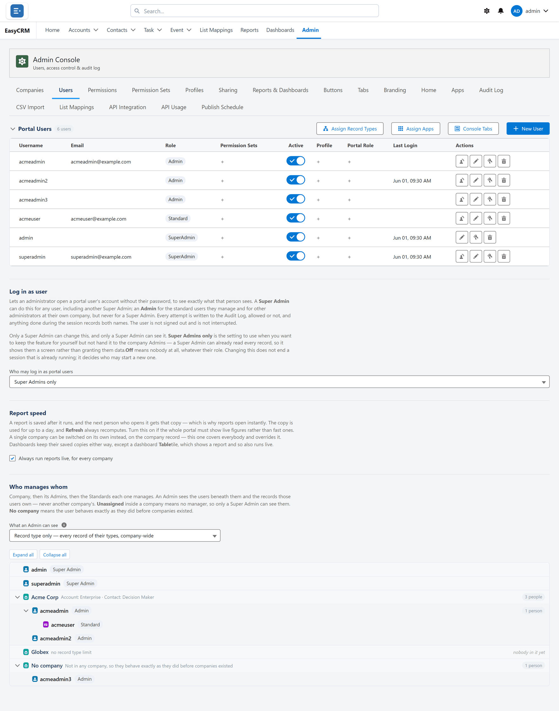
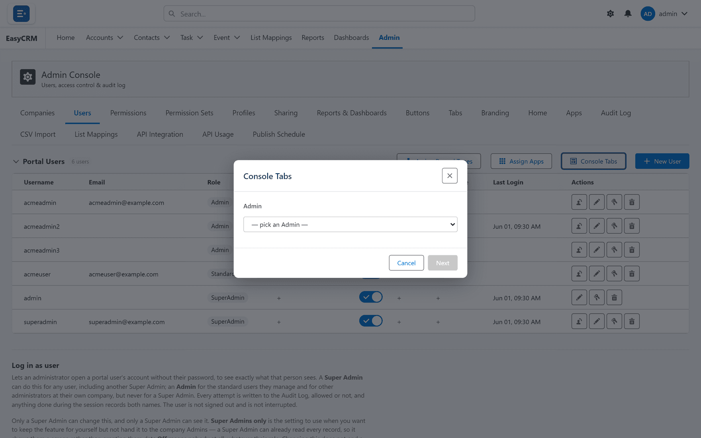
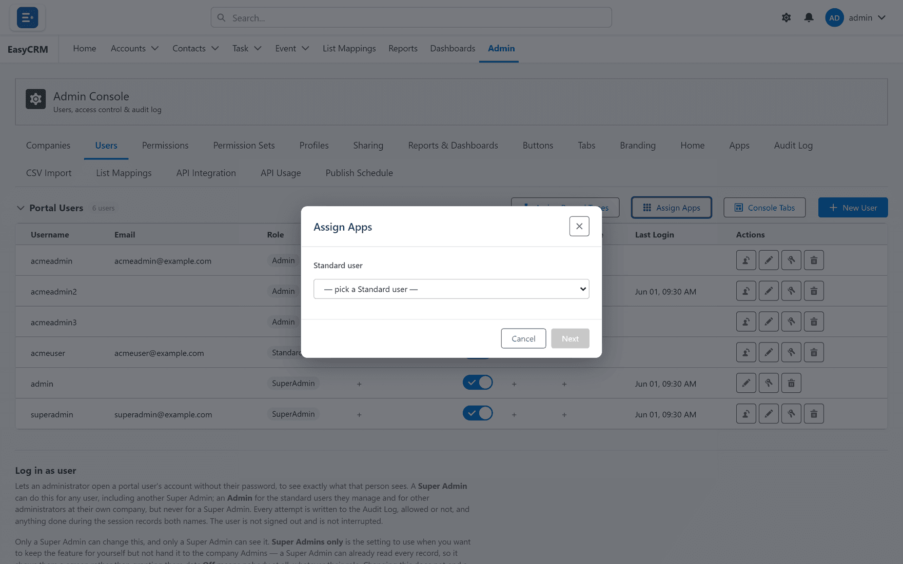
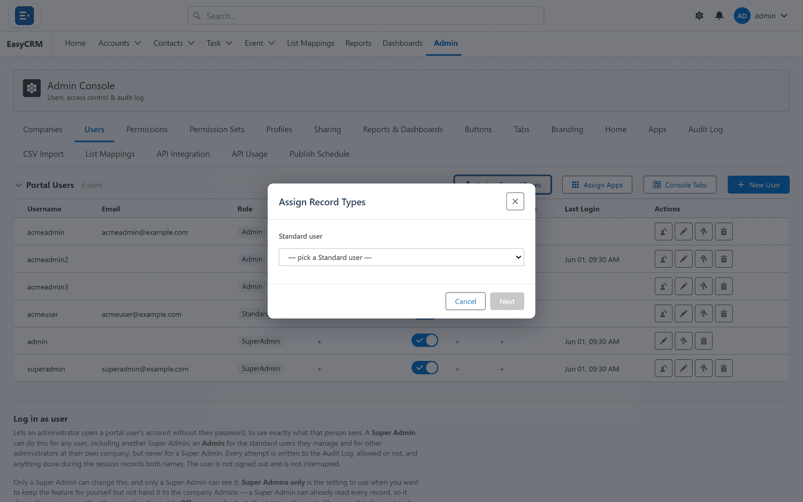

# Users

Click **Admin**, then **Users**.

Every person who can sign in is listed here.

## Adding someone

1. Click **+ New User**.
2. Type their username and email address.
3. Choose a role:
   - **Standard** sees their own records.
   - **Admin** manages the people at their company.
   - **Super Admin** manages everything.
4. Choose their company.
5. Click **Save**.

They get an email with their password.

## Turning someone off

Use the **Active** switch. They can no longer sign in, but their records stay exactly as they
are. This is what to use when somebody leaves.

## Setting a new password

Click the key beside their name, then **Save**. They get the new password by email.

## Logging in as someone

Click the person icon beside their name to see the portal exactly as they see it. Use this to
check a problem somebody has reported.

Every attempt is written to the [Audit Log](./audit-log.md), and so is anything you do while
you are in there. The person is not signed out and does not notice.

A Super Admin can do this for anyone. An Admin can do it for the Standard users they manage
and for other Admins at their own company, but never for a Super Admin.

This is switched off until a Super Admin turns it on.

## Assign Apps, Record Types and Console Tabs

The three buttons above the table set, for the whole company:

| Button | What it controls |
|---|---|
| **Assign Apps** | Which apps people can switch between. |
| **Assign Record Types** | Which kinds of record they can create. |
| **Console Tabs** | Which Admin Console tabs their Admins see. |

**Assign Apps** controls which apps the company can switch between.

**Assign Record Types** controls which kinds of record people may create.

