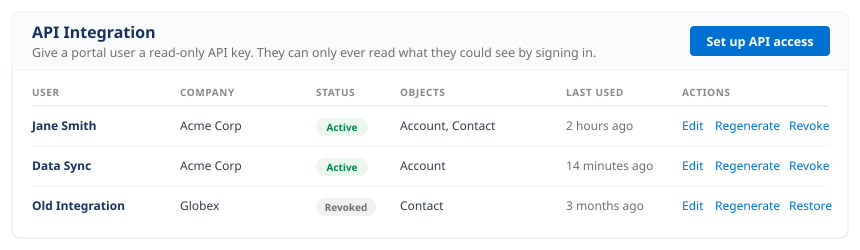
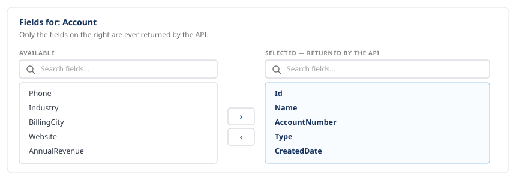
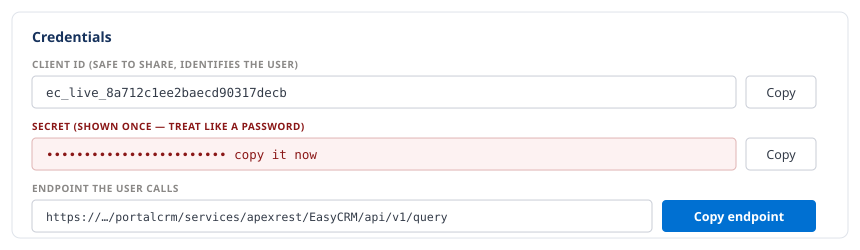
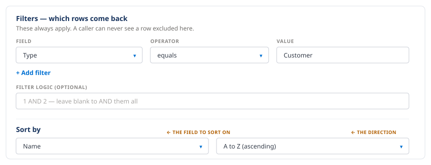
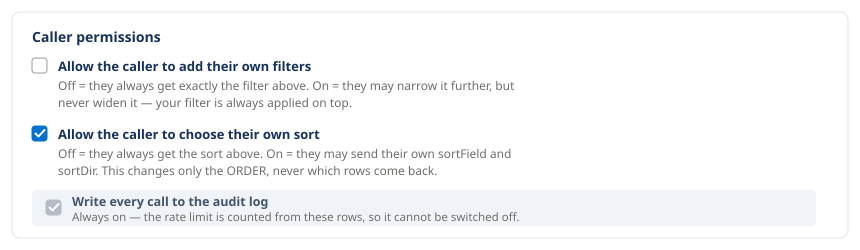

# Setting up a key

For administrators. This is how somebody gets API access, and how you control what they can
reach with it.

## Before you start

The **API Integration** tab lives in the Admin Console.

A **Super Admin** always sees it. A **company Admin** sees it only once a Super Admin has
switched it on for their company:

> Admin → **Companies** → open the company → **Admin Tabs** →
> tick **Allow company admins to manage API access**

Until that is ticked, a company Admin opening the tab is told that API access is not
delegated to their company. That switch is Super Admin only — an Admin cannot grant it to
themselves.

Once delegated, an Admin may issue keys to **their own company's Standard users only** —
never to another Admin, never to another company, never to a Super Admin.

## The five steps

### 1. Open the tab

**Admin Console → API Integration.** The list shows everyone who already has a key, with
their company, the objects they may read, whether the key is active, and when it was last
used.

Press **Set up API access** to add one, or **Edit** on a row to change an existing one.

### 2. Choose the user and the rate limit

Pick the person the key belongs to — you can search by name or company. The key acts as
that user, which is what keeps it inside their existing permissions.

**Calls per hour** caps how many requests the key may make in any hour. 500 is the normal
setting. It exists to protect the portal: the API shares the site's request budget with it,
so one runaway export could otherwise slow the portal down for everyone.

### 3. Add the objects

Press **Add object** and choose one, for example `Account`. Repeat for each.

An object you do not add here does not exist as far as this key is concerned — a request
for it is refused.

### 4. Choose the fields

For each object you get two lists side by side. Move what you want from **Available** across
to **Selected — returned by the API**. There is a search box above each list.

Only Selected fields are ever returned. This is also the list that limits what the caller
may sort by.

### 5. Save

The **Credentials** section appears, with three values:

| | |
|---|---|
| **Client ID** | safe to share, identifies the key |
| **Secret** | **shown once** — copy it now |
| **Endpoint the user calls** | with a **Copy endpoint** button |

Send the person **all three**. Without the endpoint they have nowhere to send a request.

:::caution The Secret is shown once
It is stored hashed, so it genuinely cannot be looked up later. If it is lost, press
**Regenerate** — the old Secret stops working immediately and a new one is shown.
:::

## Limiting which rows come back

Under **Filters — which rows come back**, press **+ Add filter**. Each filter is three
boxes: **Field**, **Operator**, **Value**.

These always apply. A caller can never see a row your filter excluded.

The **Filter logic** box is optional. Leave it blank to require all filters, or write
`1 AND 2`, `1 OR 2`, `(1 OR 2) AND 3` — the numbers are the filter rows in order.

See [Filters and sorting](./filters-and-sorting.md) for the operators and how a caller's own
filters combine with yours.

## Choosing the order

**Sort by** is two drop-downs just under the filters: the field on the left, the direction
on the right. There are no labels on screen, so it is left then right. Leave the field as
`(none)` for the default order.

Only fields the platform can actually order by are offered — Address and long text fields
are left out because they cannot be sorted on at all.

## Caller permissions

Two tick boxes, both off by default:

**Allow the caller to add their own filters.** Off, they always get exactly your filter. On,
they may narrow it further — never widen it, because your filter is always applied on top.

**Allow the caller to choose their own sort.** Off, they always get your order. On, they may
send their own field and direction. This changes only the order, never which rows come back,
and they may only sort by a field you selected.

Below those is **Write every call to the audit log**, shown ticked and locked. It is not a
choice: the rate limit is counted from those rows, so switching them off would switch the
rate limit off with them.

## Afterwards

Each row in the list has three actions:

| Action | What it does |
|---|---|
| **Edit** | change objects, fields, filters, sort or calls per hour at any time |
| **Regenerate** | issue a new Secret — the old one stops working straight away |
| **Revoke** | switch the key off until you switch it back on |

To see whether a key is actually being used, and what it has been doing, use the
[API Usage tab](./api-usage-tab.md).
