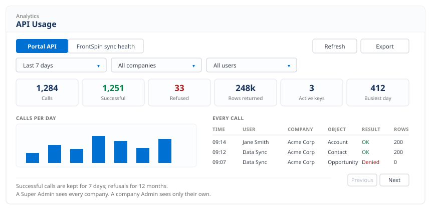

# API Usage tab

**Admin Console → API Usage.**

A separate screen from [setting up a key](./admin-setup.md). You do not need it to issue
access — it is where you look afterwards, to see whether a key is being used, how heavily,
and whether anything is being refused.

## Two halves

A switch at the top left changes the whole screen:

- **Portal API** — the API described in these pages
- **FrontSpin sync health** — the FrontSpin integration, if the org has one

If FrontSpin is not installed the second half simply says so. Nothing is broken.

## Narrowing what you are looking at

Three controls across the top:

| Control | Options |
|---|---|
| Period | Last 24 hours / 7 days / 30 days / 90 days |
| Company | All companies, or one |
| User | All users, or one |

Plus **Refresh** and **Export**, which saves what you are currently looking at.

:::note Who sees what
A **Super Admin** sees every company. A **company Admin** sees only their own — the company
filter cannot be used to look at anyone else's traffic.
:::

## The six numbers

| Tile | Means |
|---|---|
| **Calls** | requests made in the period |
| **Successful** | how many worked |
| **Refused** | how many were turned away — bad credentials, an object not granted, or the rate limit |
| **Rows returned** | how much data actually went out |
| **Active keys** | keys switched on right now |
| **Busiest day** | the highest number of calls on any single day |

A healthy key looks like steady Calls with Refused at or near zero. A rising Refused count
usually means either a caller asking for something they were not granted, or one hitting the
hourly limit.

## The rest of the screen

**Calls per day** is a simple bar chart of the period.

**By company** and **By user** show who is using it most.

**Every call** lists them individually — time, user, company, object, rows returned and the
result — with Previous and Next at the bottom.

## How far back it goes

**Successful calls are kept for 7 days. Refusals are kept for 12 months.**

Refusals are kept far longer on purpose: they are the rows worth having if somebody is
guessing at credentials, and they are a small fraction of the volume. Successes are the bulk
and the rate limit only ever looks back one hour, so a week is already generous.

So an empty "Last 90 days" view of successful calls is normal, not a fault.

:::caution The purge has to be switched on
The clean-up runs as a scheduled Apex job, `PortalApiRetention`, and **nothing schedules it
automatically**. Until an administrator schedules it from Setup, nothing is deleted and the
audit log grows without limit.

This matters more than it sounds: every API call writes one row, because the rate limit is
counted from those rows. A key working at the full 500 per hour produces roughly 12,000 rows
a day.
:::

## Why every call is logged

There is no option to turn it off, and the admin screen shows that setting ticked and
locked. The rate limit is measured by counting the audit rows, so switching logging off
would switch the rate limit off with it.
