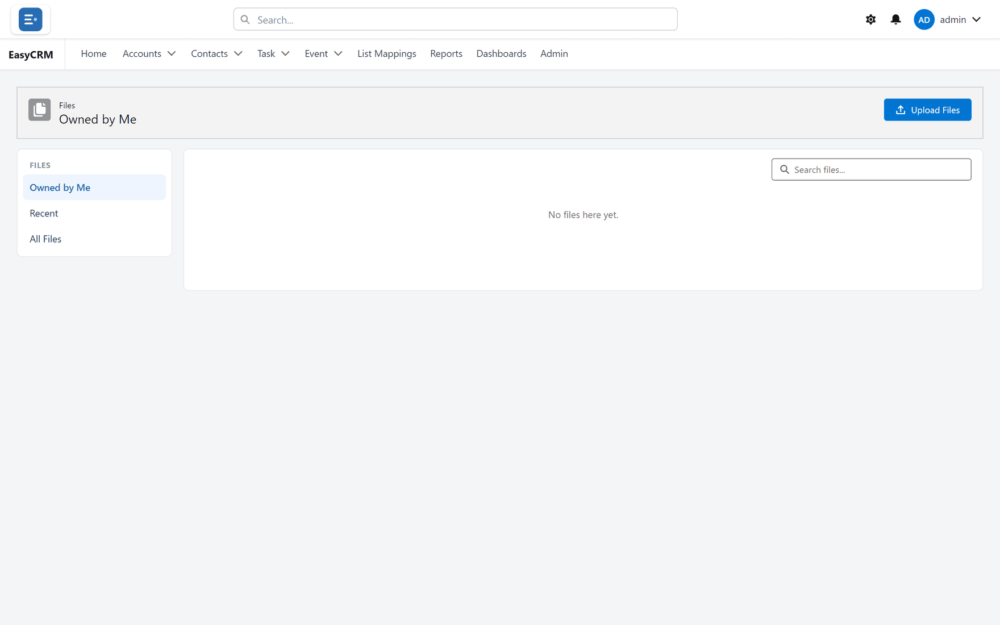
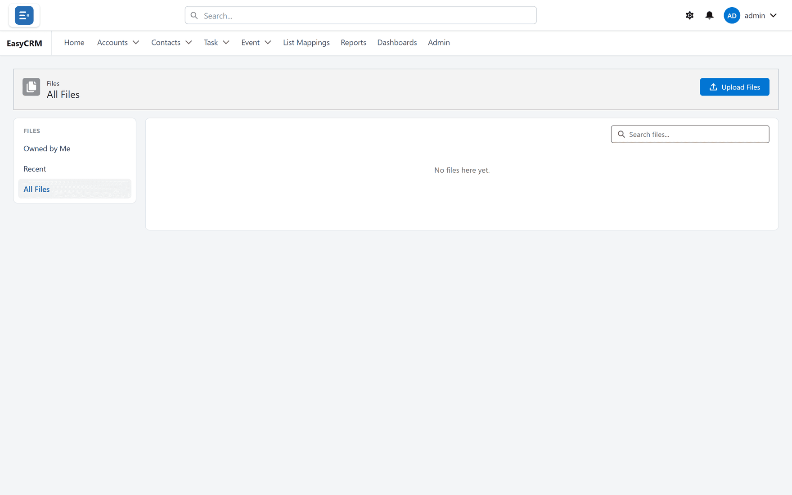
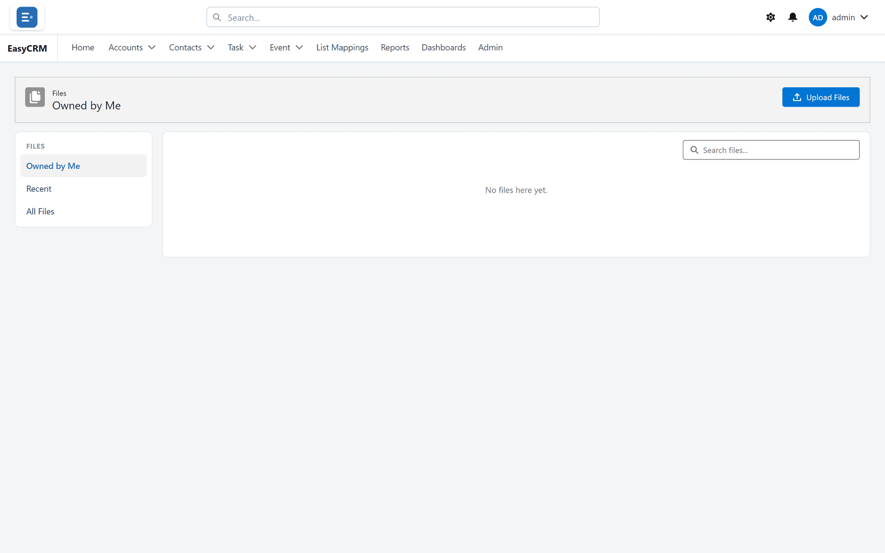

# Files

Click **Files** to see documents.

| View | Shows |
|---|---|
| **Recent** | What you opened lately. |
| **Owned by Me** | Files you uploaded. |
| **All Files** | Everything you are allowed to see. |

## Uploading

1. Click **Upload Files**.
2. Choose a file from your computer.

Switch to **Owned by Me** to see only what you uploaded.

## Files on a record

A record has its own **Files** section. Files you add there stay with that record, and anyone
who can see the record can see them.

## Opening and downloading

Click a file name to preview it. Use the menu beside it to download or delete it.
