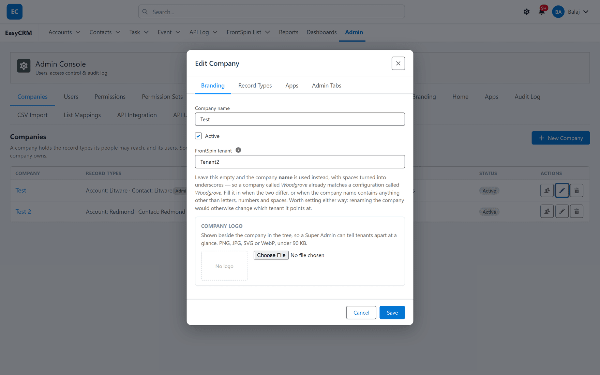

# A company's tenant

## What it is

A field on a portal company recording **which FrontSpin account that company uses**.

## Why it is needed

The portal groups people and records by company. FrontSpin groups them by tenant. This field joins
the two, so [List Mappings](./list-mappings.md) knows which tenant it is editing when you pick a
company.

## Setting it

**Where:** **Admin** → **Companies** → the pencil on a company → **Branding**

1. Click **Admin** in the top menu.
2. Click **Companies**.
3. Click the **pencil** on the company's row.
4. On the **Branding** tab, fill in **FrontSpin tenant**.
5. Click **Save**.

## Leaving it blank does not switch it off

This is the part worth reading twice.

**Blank does not mean "no tenant".** It means the **company name** is used instead, with spaces
turned into underscores. A company called `Acme Sales` already matches a configuration called
`Acme_Sales` without anybody filling anything in.

So a blank field is a working default, not a gap — as long as the two names line up.

## When you must fill it in

| Situation | Why |
|---|---|
| The names differ | The fallback matches on the company name, and it will not find the configuration |
| The company name has punctuation | The fallback only handles letters, numbers and spaces |

**And it is worth setting even when the fallback works**, for one reason: renaming the company
would otherwise silently change which tenant it points at. An explicit value survives a rename;
the fallback does not.

That is a quiet failure — somebody tidies up a company name, and a customer's mappings stop
resolving with nothing to show why.

## What to put in it

The configuration's name — the same value as the **FrontSpin Configuration Setting Name** on
[the configuration row](../setup/configuration.md), and the **Instance Name** on
[the webhook configuration](../setup/webhooks.md).

Get it from whoever set the tenant up, or read it off the configuration row in Setup. Guessing
produces a value that looks right and matches nothing.

## One company, one tenant

The field holds a single tenant. A company working two FrontSpin accounts needs two portal
companies — which is usually the right model anyway, since their users, records and sharing are
almost always meant to be separate too.

## What goes wrong

| Symptom | Cause |
|---|---|
| List Mappings shows no mappings | The resolved tenant does not match any configuration. Check spelling. |
| Mappings disappeared after a rename | The field was blank, so the company name was the tenant. Set it explicitly. |
| Mappings appear under the wrong customer | The tenant value names another customer's configuration. |
| The field is not on the form | It is part of the FrontSpin integration. Not installed, not present. |

## Where this fits

Companies in general are covered in [Companies](../../admin/companies/index.md). What the tenant
value means is [Tenants and Record Types](../understand/tenants-and-record-types.md).
