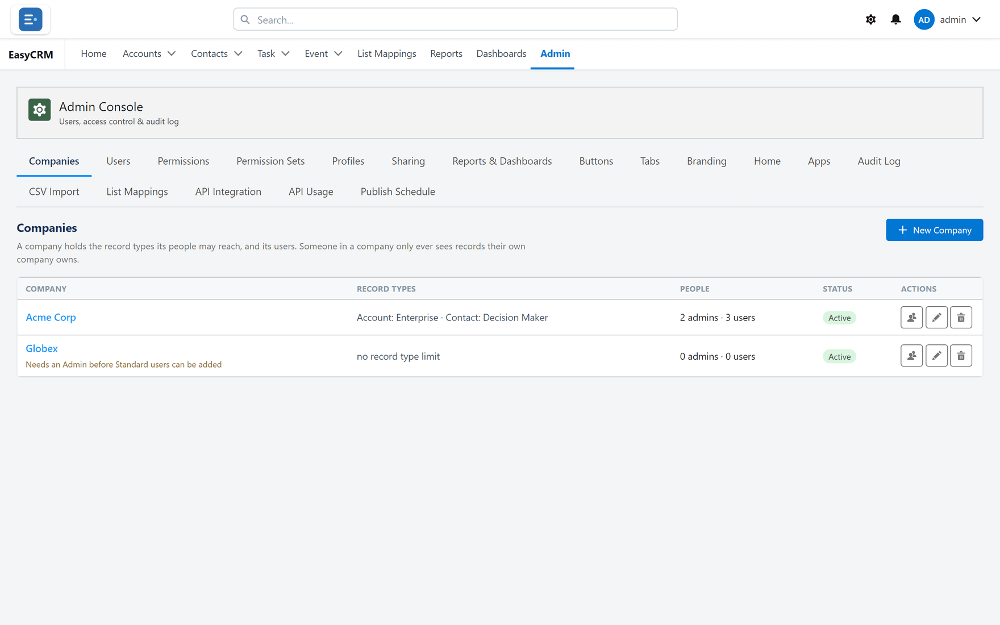

# A company's tenant

## What it is

A field on a portal company recording **which FrontSpin account that company uses**.

## Why it is needed

The portal groups people and records by company. FrontSpin groups them by tenant. This field joins
the two, so [List Mappings](./list-mappings.md) knows which tenant it is editing when you pick a
company.

## Setting it

**Where:** **Admin** → **Companies** → the company → **FrontSpin Tenant**

1. Click **Admin** in the top menu.
2. Click **Companies**.
3. Open the company.
4. Put the tenant's name in **FrontSpin Tenant**.
5. Save.

## What to put in it

The tenant's short name — the same value used as the **Instance Name** on
[the webhook configuration](../setup/webhooks.md), and matching the
[configuration row](../setup/configuration.md) for that customer.

Get it from whoever set the tenant up, or read it off the configuration row in Setup. Guessing
produces a value that looks right and matches nothing.

## One company, one tenant

The field holds a single tenant. A company working two FrontSpin accounts needs two portal
companies — which is usually the right model anyway, since their users, records and sharing are
almost always meant to be separate too.

## Leaving it blank

Blank is fine for any company that does not use FrontSpin. The only consequence is that
[List Mappings](./list-mappings.md) has nothing to work with for that company.

## What goes wrong

| Symptom | Cause |
|---|---|
| List Mappings will not let you add anything | The company has no tenant recorded. |
| Mappings appear under the wrong customer | The tenant name is wrong. Check it against the configuration row. |
| The field is not on the form | It is part of the FrontSpin integration. Not installed, not present. |

## Where this fits

Companies in general are covered in [Companies](../../admin/companies/index.md). What the tenant
value means is [Tenants and Record Types](../understand/tenants-and-record-types.md).
