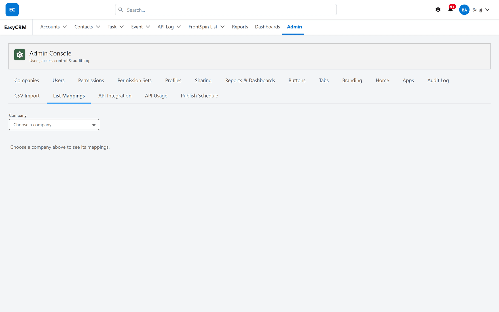
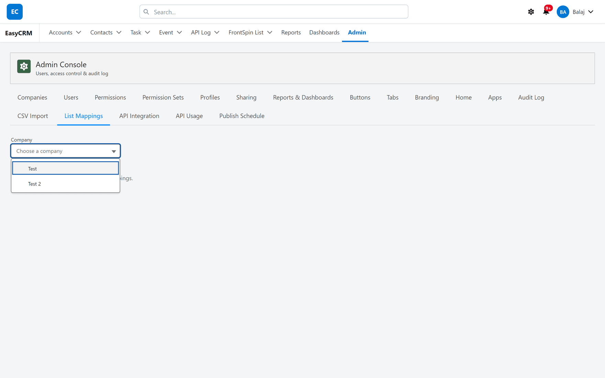
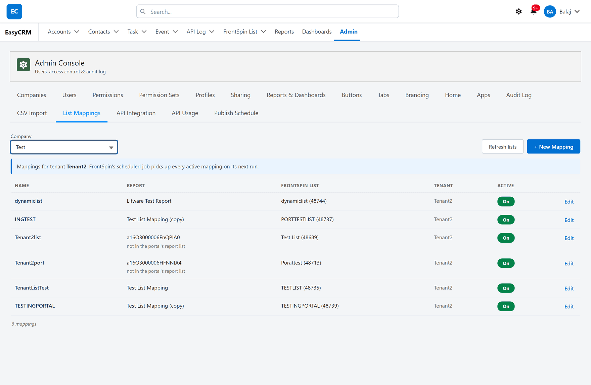
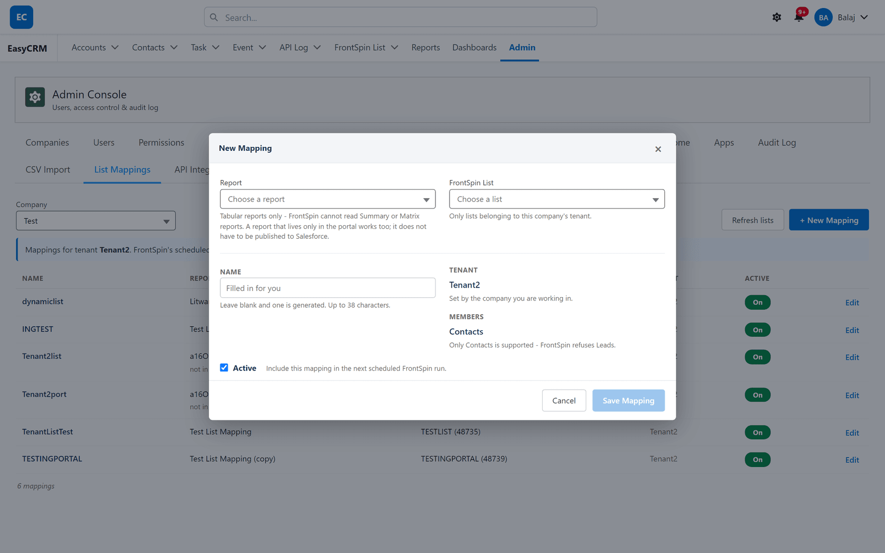
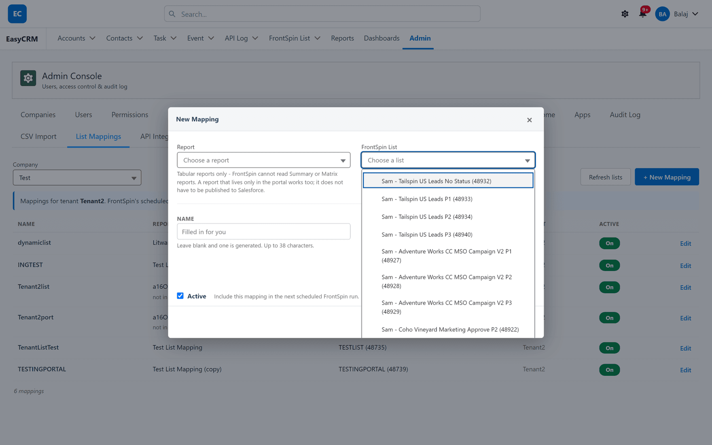

# List Mappings

## What it is

The portal end of [Report to List](../lists/report-to-list.md): which Salesforce report fills
which FrontSpin calling list, for a given company.

## Before it does anything

**It only drives the sync when the switch is set to the Custom Setting.** With the switch off —
which is the default — this tab edits a store the scheduled job does not read.

Check [Setup, or the portal](../lists/where-mappings-live.md) before using it. A mapping added
here while the switch is off looks perfectly correct and does nothing.

## Opening it

**Where:** **Admin** → **List Mappings** → choose a company

1. Click **Admin** in the top menu.
2. Click **List Mappings** in the row of tabs.
3. Nothing is shown yet — mappings belong to a company, so one has to be chosen first.

4. Click **Choose a company** and pick one.

## What you get

The blue line names the **tenant** you are editing and confirms that FrontSpin's scheduled job
picks up every active mapping on its next run — within the hour.

| Column | Shows |
|---|---|
| **Name** | What the mapping is called |
| **Report** | The Salesforce report that fills the list |
| **FrontSpin List** | The list, with its FrontSpin number in brackets |
| **Tenant** | Which FrontSpin account |
| **Active** | An **On** / **Off** switch |

The count sits under the table.

### "not in the portal's report list"

A row can show a raw report id with **not in the portal's report list** under it.

That means the mapping points at a report the portal cannot see — usually one that lives only in
Salesforce. The mapping still runs; the portal just cannot show you its name. It is a note, not an
error.

## Adding a mapping

1. Choose the company.
2. Click **+ New Mapping**.

3. Fill it in:

| Field | Notes |
|---|---|
| **Report** | **Tabular reports only.** See below. |
| **FrontSpin List** | Only lists belonging to this company's tenant are offered |
| **Name** | Leave blank and one is generated. Up to 38 characters. |
| **Tenant** | Not editable — set by the company you are working in |
| **Members** | Contacts. Not editable. |
| **Active** | Include this mapping in the next scheduled run |

4. Click **Save Mapping**.

### Tabular reports only

**FrontSpin cannot read Summary or Matrix reports.** Only a tabular report can fill a list, so a
grouped report will not be offered.

If the report you want is grouped, make a tabular copy of it for this purpose.

### A portal-only report works

The report does **not** have to be published to Salesforce. A report that exists only in the
portal can fill a FrontSpin list perfectly well.

That is worth knowing because it removes a step people often assume is required.

### Contacts only

**Members** is fixed at Contacts, because FrontSpin refuses Leads. There is nothing to choose.

## The list picker

Each entry shows the list name and its FrontSpin number. **Only this company's tenant's lists are
offered**, so you cannot accidentally point one customer's report at another customer's calling
list.

## Refresh lists

The picker can only offer lists Salesforce already knows about. **Refresh lists** asks FrontSpin
for the current set.

**It can add lists that are new. It cannot update ones already recorded.**

The portal runs as the site's guest user, and a Guest User Licence forbids editing records — no
permission set can change that. So refreshing a list already in Salesforce fails with a duplicate
error on the list's key, which is expected rather than a fault.

Keeping existing entries current is the hourly
[List Catalog job](../lists/index.md)'s work. It runs as a real user and has no such limit.

In practice: use **Refresh lists** when a brand-new list has just been created in FrontSpin and
you do not want to wait an hour. For everything else, the hourly job handles it.

## Turning one off

Use the **Active** switch on the row. Off means the scheduled job skips it; the mapping is kept.

Prefer this to deleting. Nothing can remove people a mapping has already added to a list, so
switching it off is the only way to stop it growing.

## What goes wrong

| Symptom | Cause |
|---|---|
| "FrontSpin is not set up in this org" | The integration is not installed. See [the boundary](../index.md#an-important-boundary). |
| A new mapping does nothing | The [switch](../lists/where-mappings-live.md) is off, so Setup is the live source. |
| Your report is not in the picker | It is a Summary or Matrix report. Only tabular reports can be used. |
| A list is missing from the picker | The catalogue has not caught up. Click **Refresh lists**, or wait for the hourly job. |
| "duplicate value found" on refresh | The guest cannot update an existing list. Expected — see above. |
| A row shows a raw id | The report lives outside the portal. Harmless. |
| Contacts added but the list looks short | FrontSpin applies additions asynchronously. Give it a few minutes. |

## Where this fits

What a mapping actually does is [Report to List](../lists/report-to-list.md). Where mappings are
stored is [Setup, or the portal](../lists/where-mappings-live.md).
