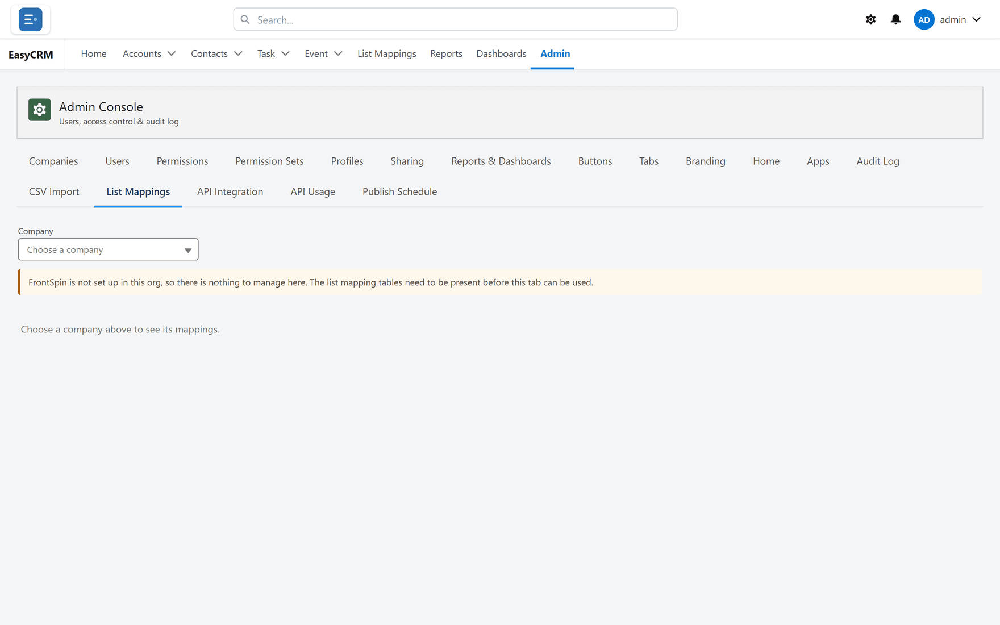

# List Mappings

## What it is

The portal end of [Report to List](../lists/report-to-list.md): which Salesforce report fills
which FrontSpin calling list, for a given company.

## Before it does anything

**It only drives the sync when the switch is set to the Custom Setting.** With the switch off —
which is the default — this tab edits a store the scheduled job does not read.

Check [Setup, or the portal](../lists/where-mappings-live.md) before using it. A mapping added
here while the switch is off looks perfectly correct and does nothing.

## Opening it

**Where:** **Admin** → **List Mappings** → choose a company

1. Click **Admin** in the top menu.
2. Click **List Mappings** in the row of tabs.
3. Choose a **Company**. Mappings belong to one, so nothing shows until you do.

Once chosen, the page names the tenant it is working with and lists that company's mappings.

The blue line confirms which tenant you are editing, and that FrontSpin's scheduled job will pick
up every active mapping on its next run — within the hour.

## Adding a mapping

1. Choose the company.
2. Click **New**.
3. Fill in:

| Field | What to put |
|---|---|
| **Report** | The Salesforce report whose contacts should be added |
| **FrontSpin List** | The calling list they go into |
| **Member Type** | `Contacts` |
| **Active** | Tick it |

4. Click **Save**.

It takes effect on the job's next hourly run. There is nothing to restart.

## The company must have a tenant first

The page needs to know which FrontSpin account a company belongs to. If the company has no tenant
recorded, say so first — see [A company's tenant](./company-tenant.md).

## Refresh lists

The **FrontSpin List** picker can only offer lists Salesforce knows about. **Refresh lists** asks
FrontSpin for the current set.

**It can add lists that are new. It cannot update ones already recorded.**

The portal runs as the site's guest user, and a Guest User Licence forbids editing records — no
permission set can change that. So refreshing a list already in Salesforce fails with a duplicate
error on the list's key, which is expected rather than a fault.

Keeping existing entries current is the hourly
[List Catalog job](../lists/index.md)'s job. It runs as a real user and has no such limit.

In practice: use **Refresh lists** when a brand-new list has just been created in FrontSpin and
you do not want to wait an hour. For everything else, the hourly job handles it.

## What goes wrong

| Symptom | Cause |
|---|---|
| "FrontSpin is not set up in this org" | The integration is not installed. See [the boundary](../index.md#an-important-boundary). |
| A new mapping does nothing | The [switch](../lists/where-mappings-live.md) is off, so Setup is the live source. |
| A list is missing from the picker | The catalogue has not caught up. Click **Refresh lists**, or wait for the hourly job. |
| "duplicate value found" on refresh | The guest cannot update an existing list. Expected — see above. |
| Contacts are added but the list looks short | FrontSpin applies additions asynchronously. Give it a few minutes. |

## Where this fits

What a mapping actually does is [Report to List](../lists/report-to-list.md). Where mappings are
stored is [Setup, or the portal](../lists/where-mappings-live.md).
