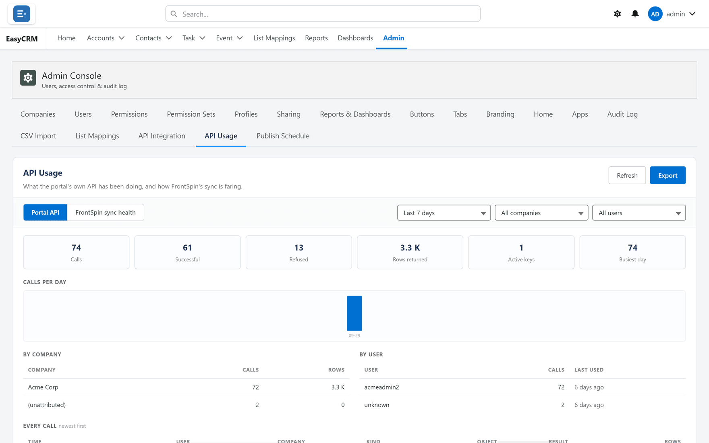

# Sync health

## What it is

A view inside the portal's **API Usage** tab showing how the FrontSpin integration is faring —
without needing a Salesforce login.

## Opening it

**Where:** **Admin** → **API Usage** → **FrontSpin sync health**

1. Click **Admin** in the top menu.
2. Click **API Usage**.
3. The page opens on **Portal API**. Click **FrontSpin sync health** beside it.

## Two separate things on one tab

They share a page but have nothing to do with each other:

| View | Is about |
|---|---|
| **Portal API** | Other systems reading **your** portal through its API |
| **FrontSpin sync health** | **Your** org talking to FrontSpin |

A quiet Portal API says nothing about FrontSpin, and the reverse.

## What to look for

| Sign | Usually means |
|---|---|
| A steady trickle of activity | Normal |
| Nothing at all, on a working day | The sync has stopped. Check the scheduled jobs. |
| A sharp spike | A bulk load, or a mapping sending more than you expected |
| Failures climbing | Start at [sync errors](../troubleshooting/sync-errors.md) |

## Filters

The same controls as the Portal API view: a date range, and narrowing by company. Use the date
range to compare a bad day with a normal one — the shape of the difference usually names the
cause faster than any single number.

## What it does not show

It is a summary, not a record-by-record account. For "why did **this** contact not sync?" you
need [sync errors](../troubleshooting/sync-errors.md), which are per record and in Salesforce.

## Where this fits

The portal's own API is covered in [API Usage](../../admin/data/api-usage.md). The detail behind
these figures is in [Troubleshooting](../troubleshooting/index.md).
