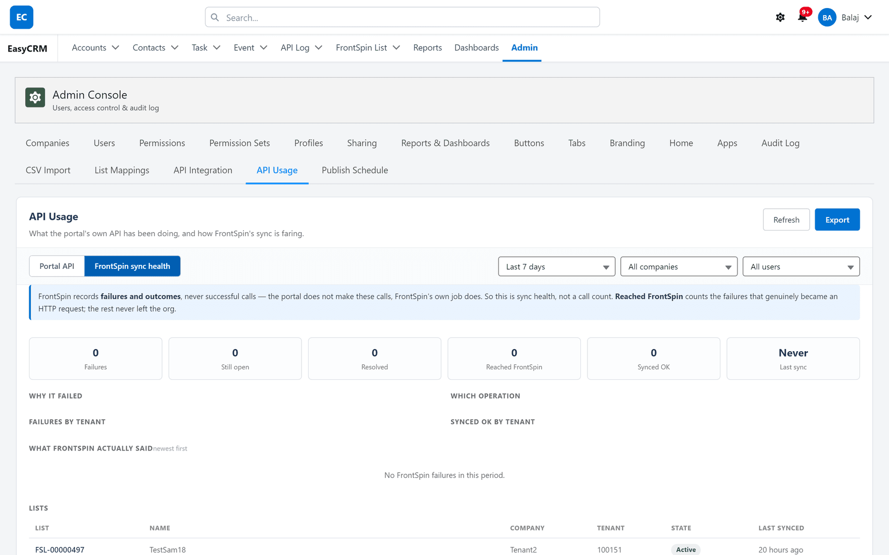

# Sync health

## What it is

A view inside the portal's **API Usage** tab showing how the FrontSpin integration is faring —
without needing a Salesforce login.

## Opening it

**Where:** **Admin** → **API Usage** → **FrontSpin sync health**

1. Click **Admin** in the top menu.
2. Click **API Usage**.
3. The page opens on **Portal API**. Click **FrontSpin sync health** beside it.

## Read the banner first

> FrontSpin records **failures and outcomes**, never successful calls — the portal does not make
> these calls, FrontSpin's own job does. So this is sync health, not a call count.

That single sentence prevents the most common misreading of this screen. **A low number here is
good.** It is not a measure of how much work the integration did; it is a measure of how much of
it went wrong.

## The six figures

| Tile | Means |
|---|---|
| **Failures** | How many syncs failed in the period |
| **Still open** | Of those, how many are unresolved |
| **Resolved** | How many later succeeded |
| **Reached FrontSpin** | Failures that genuinely became an HTTP request |
| **Synced OK** | Records that went through |
| **Last sync** | When the integration last did anything |

### Reached FrontSpin is the useful one

It splits failures into two very different kinds:

- **Reached FrontSpin** — the request left your org and FrontSpin answered badly. The problem is
  at their end, or in what was sent.
- **The rest** — the request never left the org at all. That is configuration, routing or
  permissions, and it is yours to fix.

Checking that split first tells you which half of the system to look at, and saves most of the
time people spend guessing.

### "Last sync: Never"

Exactly what it sounds like. If the integration is meant to be live, this is the first thing to
act on — check the scheduled jobs exist and their owner is still active.

## The breakdowns

| Section | Answers |
|---|---|
| **Why it failed** | Which [failure classes](../troubleshooting/retries.md) came up |
| **Which operation** | Create, update, resync or inbound |
| **Failures by tenant** | Whether it is one customer or all of them |
| **Synced OK by tenant** | Which tenants are working |
| **What FrontSpin actually said** | The real responses, newest first |

**Failures by tenant** is the fastest triage on the page. One tenant failing is a configuration or
credential problem for that customer. Every tenant failing at once is something shared — a
scheduled job, or the integration as a whole.

**What FrontSpin actually said** is worth reading rather than skimming. It is their words, not a
summary, and it often names the problem outright.

## The Lists table

Underneath is every FrontSpin list the catalogue knows about:

| Column | Shows |
|---|---|
| **List** | The catalogue record |
| **Name** | The list's name in FrontSpin |
| **Company** | The portal company, where one matches |
| **Tenant** | Which FrontSpin account |
| **State** | Active or Inactive in FrontSpin |
| **Last synced** | When the catalogue last saw it |

**Last synced** is the one to watch. A list whose date has stopped moving while others update has
disappeared from FrontSpin — the catalogue
[never deletes](../lists/index.md#nothing-is-ever-deleted), so a stale date is the only signal.

## Narrowing it

The same controls as the Portal API view: a date range, a company and a user. **Refresh** fetches
the latest figures and **Export** downloads them.

Use the date range to compare a bad day with a normal one — the shape of the difference usually
names the cause faster than any single number.

## Two separate things on one tab

| View | Is about |
|---|---|
| **Portal API** | Other systems reading **your** portal through its API |
| **FrontSpin sync health** | **Your** org talking to FrontSpin |

A quiet Portal API says nothing about FrontSpin, and the reverse.

## What it does not show

It is a summary, not a record-by-record account. For "why did **this** contact not sync?" you
need [sync errors](../troubleshooting/sync-errors.md), which are per record and in Salesforce.

## Where this fits

The portal's own API is covered in [API Usage](../../admin/data/api-usage.md). The detail behind
these figures is in [Troubleshooting](../troubleshooting/index.md).
