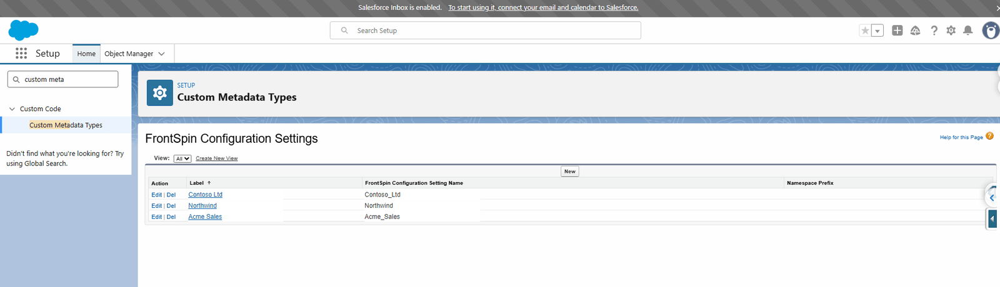
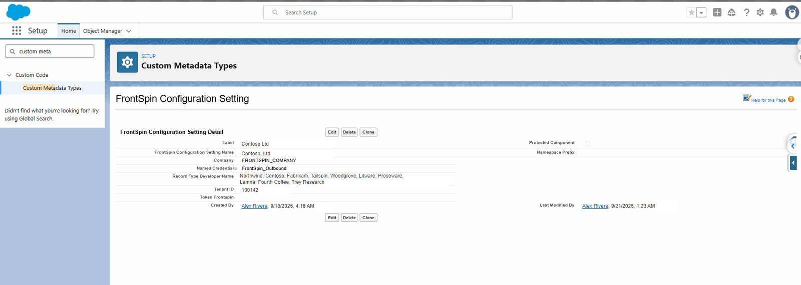

# Step 2 — The configuration row

## What you are doing

Joining the Record Type from step 1 to a FrontSpin tenant. This is the row that makes a record
sync anywhere at all.

## Where

**Setup** → search **Custom Metadata Types** → **FrontSpin Configuration Settings** → **Manage
Records**

1. In Setup, type `custom meta` into the quick-find box on the left.
2. Click **Custom Metadata Types**.
3. Find **FrontSpin Configuration Settings** and click **Manage Records**.

One row per customer. Click **New** to add one, or a **Label** to open it.

## What a row holds

| Field | What to put | Notes |
|---|---|---|
| **Label** | The customer's name | What you will see in lists |
| **FrontSpin Configuration Setting Name** | Fills itself in | The **developer name**, used by [list mappings](../lists/report-to-list.md) |
| **Company** | The company name as FrontSpin knows it | |
| **Named Credential** | The credential holding the API key | See below |
| **Record Type Developer Name** | The developer names from [step 1](./record-types.md), comma-separated | One row can cover many |
| **Tenant ID** | The number FrontSpin gave you | e.g. `100142` |
| **Token Frontspin** | Usually left blank | Only used where no Named Credential exists |

## Record Type Developer Name takes a list

This is the field people most often under-use. It accepts **several** developer names separated by
commas, so one customer with ten Record Types needs one row, not ten.

Type them exactly as the Record Type Name appears — no spaces around the commas is safest.

## About the Named Credential

A Named Credential is where Salesforce keeps the API key. The integration never reads the key,
never holds it and never writes it to a log — it asks the platform to attach it.

That is why the **Token Frontspin** field is normally blank. Putting a key there means it lives in
configuration you can read, which is worse. Use a Named Credential unless somebody has told you
otherwise.

Setting up the Named Credential itself is standard Salesforce work: **Setup** → **Named
Credentials** → **New**, pointing at FrontSpin's API base address with the key as the
authentication.

## Saving and checking

Click **Save**. The row takes effect immediately — there is no deploy and no cache to clear.

Then run the [health check](./checking-it.md), which will tell you whether the row resolves.

## What goes wrong

| Symptom | Cause |
|---|---|
| Nothing syncs for this customer | The Record Type developer name does not match exactly. Check spelling and capitals. |
| "The named configuration is missing or incomplete" | A blank Tenant ID or Named Credential. |
| Records reach the wrong FrontSpin | Two rows claim the same Record Type. See [the eight outcomes](../routing/outcomes.md). |
| Still nothing, and no errors | No rows exist at all — the integration treats that as "not switched on" and stays quiet on purpose. |

That last row is worth remembering. With **zero** configuration rows the integration does not log
a failure per record, because that would put hundreds of pointless rows in the log for one bulk
load. It simply does nothing. Once at least one row exists, unroutable records *are* logged.

## Where this fits

Next: [permissions](./permissions.md), without which the scheduled jobs cannot write anything.
