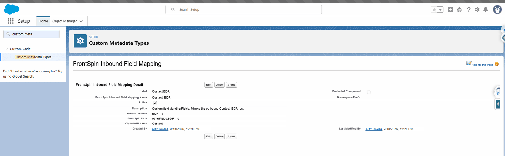

# Step 5 — Fields coming back

## What you are doing

Saying which values arriving **from** FrontSpin should be written onto the Salesforce record.

This is a **separate** list from [fields going out](./fields-going-out.md), on purpose. A field you
send is not automatically a field you accept back, and for most fields you do not want it to be —
otherwise FrontSpin could overwrite the number your team just corrected.

## Where

**Setup** → **Custom Metadata Types** → **FrontSpin Inbound Field Mapping** → **Manage Records**



## What a mapping holds

| Field | Means |
|---|---|
| **Label** | What you call it |
| **Object API Name** | `Contact`, `Account` or `Lead` |
| **Salesforce Field** | Where the value lands |
| **FrontSpin Path** | Where to find it in the incoming message |
| **Active** | Untick to switch it off |
| **Overwrite With Blank** | Whether an empty incoming value clears the Salesforce field |
| **Description** | Free text. Worth filling in. |

## FrontSpin Path

The incoming message is structured, so the path says where in it to look. A custom field arrives
under `otherFields`, so the path is typically:

```
otherFields.BDR__c
```

A built-in FrontSpin field is named directly, with no prefix.

## Overwrite With Blank

Off — an empty incoming value is ignored, and Salesforce keeps what it has.

On — the empty value is written, and the Salesforce field is cleared.

**Leave it off unless you are certain.** On means a blank in FrontSpin can wipe a value in
Salesforce, and the person who typed that value will not be told.

## Pairing inbound with outbound

For a field that should round-trip, create **both** a
[field going out](./fields-going-out.md) and a field coming back, with matching names. The
description field is a good place to note that they are a pair — the screen above does exactly
that.

For a field Salesforce owns, create only the outbound one. For a field FrontSpin owns — a call
outcome, say — create only the inbound one.

## What goes wrong

| Symptom | Cause |
|---|---|
| The value never arrives | **Active** unticked, or the path is wrong. |
| It arrives on the wrong field | **Salesforce Field** names a different field. |
| A good value was replaced by a blank | **Overwrite With Blank** is on. |
| A custom field never arrives | The path probably needs the `otherFields.` prefix. |

## Where this fits

Field mappings describe *what* comes back. [Webhooks](./webhooks.md) are *how* it gets here, and
without them nothing arrives at all.
