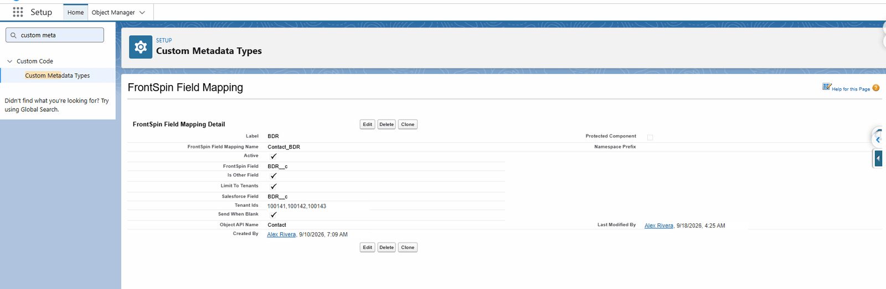

# Step 4 — Fields going out

## What you are doing

Saying which Salesforce fields should travel to FrontSpin when a record is sent. Standard fields
go anyway; this is for your own.

**This step is optional.** Skip it and the integration still syncs.

## Where

**Setup** → **Custom Metadata Types** → **FrontSpin Field Mapping** → **Manage Records**

## What a mapping holds

| Field | Means |
|---|---|
| **Label** | What you call it |
| **Object API Name** | `Contact`, `Account` or `Lead` |
| **Salesforce Field** | The field's API name, e.g. `BDR__c` |
| **FrontSpin Field** | The name FrontSpin knows it by |
| **Active** | Untick to switch the mapping off without deleting it |
| **Is Other Field** | See below |
| **Send When Blank** | Whether an empty value is sent, or the field omitted |
| **Skip Change Detection** | Send this field even when nothing changed |
| **Limit To Tenants** | Apply this mapping only to some tenants |
| **Tenant Ids** | Which ones, comma-separated |

## Is Other Field

FrontSpin has a fixed set of built-in fields, plus a bag of custom ones.

- **Unticked** — the field maps to one of FrontSpin's built-in fields.
- **Ticked** — the field goes into FrontSpin's custom-field area.

Anything of your own invention is almost always **ticked**.

## Send When Blank, and why it matters

With it **off**, an empty Salesforce field is left out of the message entirely, so FrontSpin keeps
whatever it already had.

With it **on**, the empty value is sent, and FrontSpin's value is cleared.

**Off is the safer default.** On is right when Salesforce is the authority for that field and
clearing it in Salesforce should clear it everywhere.

## Limit To Tenants

Leave unticked and the mapping applies to every tenant.

Tick it, and fill in **Tenant Ids** with a comma-separated list, to apply the mapping only to
those tenants. Use it when one customer has a custom field others do not.

## Skip Change Detection

Normally a record is only sent when a mapped field actually changed — which keeps you inside
FrontSpin's daily request allowance.

Tick this to send the field regardless. Use it sparingly: on a busy object it can turn a quiet
day into a day that exhausts the quota.

## A sensible order to add mappings

1. Start with none and confirm records sync at all.
2. Add the two or three fields the calling team actually reads.
3. Add the rest later, if anybody asks.

Mapping forty fields on day one makes the first failure much harder to diagnose.

## Contacts with no email address

FrontSpin **requires** an email on every contact it is given. A contact with a phone number but no
email would therefore be refused outright and never reach the dialler at all — which, for a
calling list, is the wrong outcome: the phone number is the part that matters.

So when the email is the **only** thing missing, a stand-in address is sent instead:

\`\`\`
fake@<company-name>.com
\`\`\`

Two things about this are worth knowing, because both are visible to whoever uses FrontSpin.

**The address is shared by everybody at that company.** It is built from the company name, not the
person, so every contact at one company carries the identical address. A company with four hundred
contacts has four hundred records showing the same email.

**The domain may be a real one.** \`fake@acmewidgets.com\` is a plausible live mailbox at the real
company. To make sure nothing is ever sent to it, **email opt-out is forced on** for every contact
given a stand-in address.

A contact with a genuine email is never given one.

### What this means in practice

| | |
|---|---|
| In FrontSpin | Expect \`fake@…\` addresses. They mark contacts with no email in Salesforce. |
| For emailing | Those contacts are opted out. Do not undo that. |
| For [matching](../understand/matching.md) | Email cannot distinguish them, so matching falls back to phone and name. |
| To remove one | Put a real email on the Salesforce contact and let it sync. |

## What goes wrong

| Symptom | Cause |
|---|---|
| The field never arrives | **Active** unticked, or the Salesforce API name is wrong. |
| It arrives empty | The field is empty on the record, or **Send When Blank** is off and it was cleared. |
| A custom field is rejected | **Is Other Field** should probably be ticked. |
| One tenant gets it, another does not | **Limit To Tenants** is on. |
| Lots of contacts share one odd email | Expected. See the stand-in address above. |

## Where this fits

Next: [fields coming back](./fields-coming-back.md), which is the same idea in reverse and is
configured separately.
