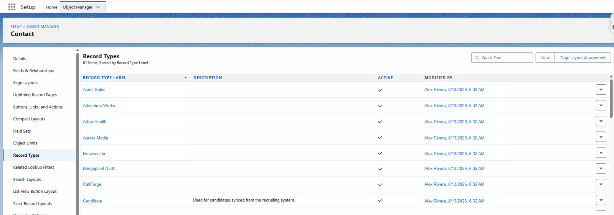

# Step 1 — The Record Type

## What you are doing

Creating the label that says "this record belongs to that customer". Everything downstream routes
on it, so it comes first.

## Where

**Setup** → **Object Manager** → **Contact** → **Record Types**

1. Click the gear, top right of Salesforce, then **Setup**.
2. Click **Object Manager** in the top bar.
3. Find and click **Contact**.
4. Click **Record Types** in the left-hand menu.

## Creating one

1. Click **New**, top right.
2. Fill in:

| Field | What to put |
|---|---|
| **Record Type Label** | The customer's name, as people say it |
| **Record Type Name** | Fills itself in. This is the **developer name** the configuration uses. |
| **Description** | Optional, but useful a year later |
| **Active** | Tick it |

3. Choose which profiles may use it.
4. Click **Next**, then **Save**.

## Write the developer name down

The **Record Type Name** — not the label — is what
[the configuration row](./configuration.md) refers to. In the screen above it is the value behind
each label.

Developer names are used rather than ids so the same configuration works in a sandbox and in
production without editing. A record type label can be renamed freely; changing the **developer
name** breaks the link and stops that customer syncing.

## Do the same on Account and Lead

If you sync Accounts or Leads for this customer, repeat the steps on those objects, using the
**same developer name**. The configuration matches on object plus developer name, so keeping them
identical across objects keeps one row covering all three.

## How many Record Types

One per customer, not one per team or per campaign. The Record Type answers "whose FrontSpin does
this belong in?", and that question has exactly as many answers as you have FrontSpin tenants.

An org with 61 Record Types on Contact is not unusual for a business running many customers'
calling operations.

## What goes wrong

| Symptom | Cause |
|---|---|
| Users cannot pick the new Record Type | Their profile was not given access in step 3 of the wizard. |
| Records are refused with "no Record Type" | Existing records were created before the Record Type existed. Set it on them. |
| One customer's records stopped syncing | The developer name was changed. Change it back, or update the configuration row. |

## Where this fits

Next: [point this Record Type at a FrontSpin tenant](./configuration.md).
