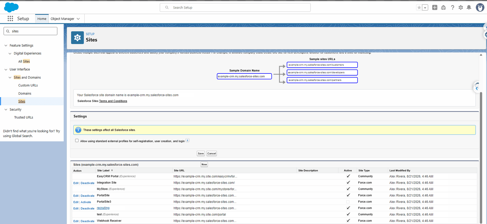
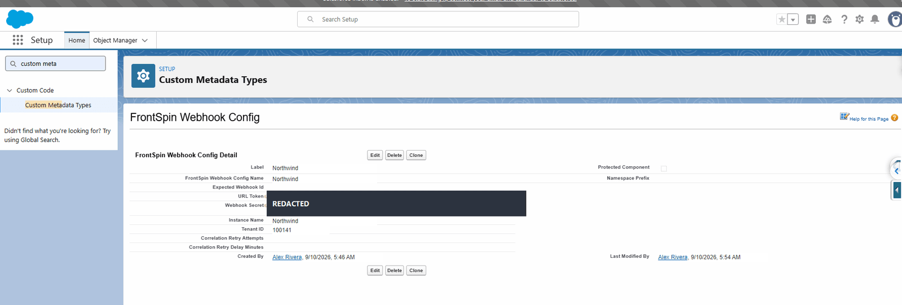
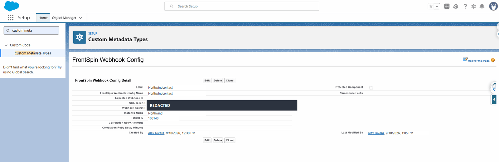

# Step 6 — Webhooks

## What a webhook is

A message FrontSpin sends to your Salesforce org the moment something happens — a call is made, a
contact is edited. Without one, nothing comes back from FrontSpin at all.

## The two halves

| Half | Where | Who does it |
|---|---|---|
| A public address to receive messages | Salesforce Setup → Sites | You, once per org |
| Configuration saying which tenant a message belongs to | Custom Metadata | You, once per tenant |

Plus telling FrontSpin the address — done in FrontSpin, usually by whoever runs that account.

## The receiving address

**Setup** → search **Sites** → **Sites**



A Force.com site is what makes a URL in your org reachable from the internet. The one that
receives FrontSpin messages is usually called something like **Webhook Receiver**.

The address FrontSpin posts to ends in:

```
/services/apexrest/frontspin/v1/<your url token>
```

The **url token** on the end is how the receiver knows which tenant the message is about — the
message body does not reliably say. That is why each tenant gets its own token.

## The tenant configuration

**Setup** → **Custom Metadata Types** → **FrontSpin Webhook Config** → **Manage Records**



| Field | What to put |
|---|---|
| **Label** | The customer's name |
| **URL Token** | The secret ending of the receiving address |
| **Webhook Secret** | The signing secret FrontSpin gave you |
| **Instance Name** | The tenant's short name |
| **Tenant ID** | The same number as in [the configuration row](./configuration.md) |
| **Expected Webhook Id** | Optional. Extra confirmation the message is genuine. |
| **Correlation Retry Attempts** | Optional. See below. |
| **Correlation Retry Delay Minutes** | Optional. See below. |

The two secrets are hidden once saved — the screens above show them blacked out for exactly that
reason.

## Per-object configuration

A tenant may have more than one row, one per kind of message:



Here the label ends in `contact`, marking it as the configuration for contact messages from that
tenant.

## The correlation retry fields

Sometimes a message arrives about a record Salesforce has not finished creating — a call logged
within a second of the contact being made.

These two fields say how many times, and how far apart, to look again before giving up. Leave them
blank unless you are seeing messages rejected for an unknown record; the defaults are sensible.

## How a message is proved genuine

FrontSpin signs every message with a header named `x-frontspin-signature`, computed from the
webhook secret and the message body. The receiver recalculates the signature and refuses anything
that does not match.

That is why the secret matters: without it, anybody who learned your URL could post fake calls
into your CRM.

## What FrontSpin does when delivery fails

It retries up to **four** times, at random intervals of one to five minutes, giving up after about
ten minutes.

So a brief outage loses nothing. A long one does, and those events do not come back — which is
why the [sync health view](../portal/sync-health.md) is worth a look after any extended outage.

## What goes wrong

| Symptom | Cause |
|---|---|
| Nothing ever arrives | FrontSpin has the wrong address, or the site is inactive. |
| Messages are refused | The **Webhook Secret** does not match the one FrontSpin is signing with. |
| They arrive but match no record | The record does not exist yet. Try the correlation retry fields. |
| One tenant works, another does not | Each tenant needs its own row and its own **URL Token**. |

## Where this fits

Last step: [check the whole thing](./checking-it.md).
