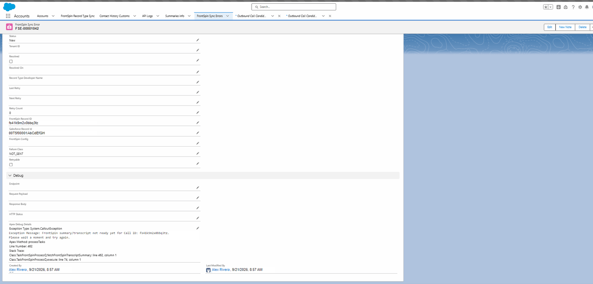

# Sync errors

## What they are

One record per failed synchronisation, carrying what failed, why, and whether another attempt is
worth making.

They exist alongside the API logs rather than replacing them, because an API log cannot answer
"what went wrong with **this** Account" — its record references are plain text, so a failure
cannot appear on the record page, and its detail fields cannot be filtered in a query.

## Opening one

**Where:** the **FrontSpin Sync Errors** tab in Salesforce

## Reading one

| Field | Tells you |
|---|---|
| **Status** | Where it is in the retry lifecycle |
| **Failure Class** | What kind of failure — see [Retries](./retries.md) |
| **Retryable** | Whether another automatic attempt will be made |
| **Retry Count** | How many have been made |
| **Next Retry** | When the next one is due |
| **Direction** | Outbound (to FrontSpin) or Inbound (from it) |
| **Operation** | CREATE, UPDATE, RESYNC or INBOUND_UPDATE |
| **Salesforce Record Id** | The record that failed |
| **FrontSpin Record ID** | Its FrontSpin counterpart, if it has one |
| **Account** / **Contact** | Proper links, so the error shows on the record |
| **Tenant ID** | Which FrontSpin account |
| **Record Type Developer Name** | What it routed on |
| **Resolved** / **Resolved On** | Whether a later attempt succeeded |

## The Debug section

| Field | Holds |
|---|---|
| **Endpoint** | The address called |
| **Request Payload** | What was sent |
| **Response Body** | What came back |
| **HTTP Status** | The response code |
| **Apex Debug Details** | The exception, if the call never completed |

In the example above, Apex Debug Details carries the whole story: FrontSpin was asked for a call
summary before it had finished producing one, and said so.

## The six statuses

| Status | Means |
|---|---|
| **New** | Just recorded |
| **Retry_Scheduled** | Will be tried again at **Next Retry** |
| **Retrying** | Being tried now |
| **Resolved** | A later attempt succeeded |
| **Failed_Permanent** | Automatic attempts are exhausted |
| **Manual_Required** | A person must decide something |

## History is never deleted

A successful retry does **not** remove the earlier error. It marks the outstanding rows
**Resolved**, with a timestamp.

So a record with resolved errors on it is a record that failed and then recovered — which is
useful, not alarming. The evidence that the first attempt failed survives on purpose.

## What to do with each kind

| Failure Class | Do |
|---|---|
| **RATE_LIMITED** | Nothing. It retries after the allowance resets. |
| **TIMEOUT** | Nothing. It retries within the hour. |
| **FRONTSPIN_SERVER_ERROR** | Nothing, at first. Raise it with FrontSpin if it persists. |
| **BAD_REQUEST** | Look at the payload. Usually a field mapping. |
| **AUTHENTICATION_FAILED** | The API key. Check the Named Credential. |
| **FORBIDDEN** | The key is valid but lacks permission. Ask FrontSpin. |
| **NOT_FOUND** | On an update, the FrontSpin record is gone. A person must decide. |
| **NOT_SENT** | Refused before any call — configuration, routing or ownership. |

[Retries](./retries.md) explains which of these retry themselves and why.

## NOT_SENT is the one to read carefully

It means the integration refused to send the record at all. That is not a FrontSpin problem — it
is this org declining to act on configuration it cannot trust.

The reason is in the error message, and is usually one of
[the eight routing outcomes](../routing/outcomes.md) or a tenant-ownership refusal.

## What goes wrong

| Symptom | Cause |
|---|---|
| The tab is not there | The integration is not installed. |
| You cannot see errors | Read access on the object. See [Permissions](../setup/permissions.md). |
| Hundreds appeared at once | A credential expired, a Record Type was renamed, or a quota ran out. |
| An error with no record link | The failure happened before a record could be identified. |
